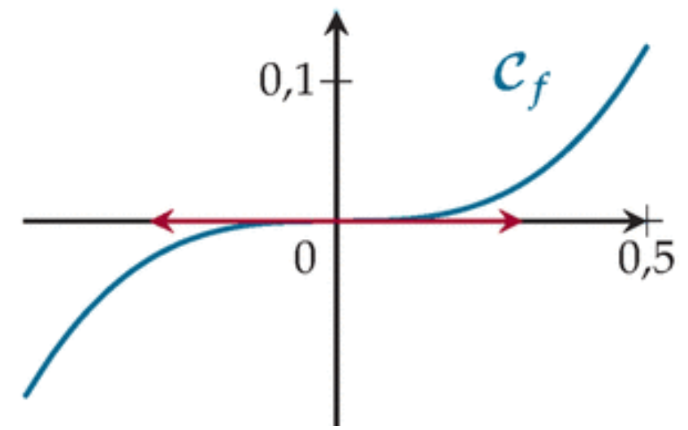
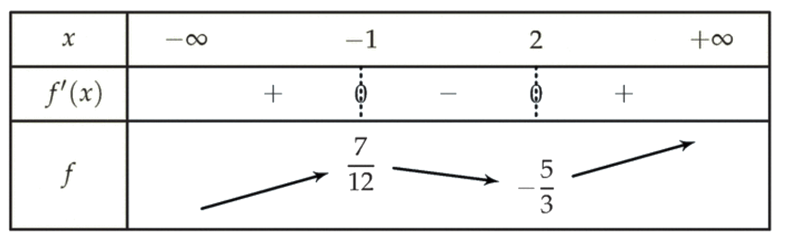

# Dérivation

## Définition

!!! info "Taux d'accroissement et dérivée"
    
    $t(h) = \frac{f(a+h) - f(a)}{h}$ s'appelle le taux de variation de $f$ entre $a + h$ et $a$.

    $f$ est une fonction et $a$ un réel de son ensemble de définition. Dire que la fonction $f$ est **dérivable en $a$** signifie que la fonction $t(h) = \frac{f(a+h) - f(a)}{h}$  admet une limite réelle $l$ en $0$ qu'on appelle alors le nombre dérivé de $f$ en $a$. On le note $f '(a)$.

???- tip "Approximation affine"

    Si $f$ est dérivable en $a$ pour des réels $h$ proche de $0$

    \[
    f(a+h) \approx f(a) + h \times f'(a)
    \]

## Tangente

!!! info "Equation de tangente"
    $\mathcal{C}_f$ est la courbe représentative d'une fonction $f$ qui est dérivable au point $a$. **La tangente** à $\mathcal{C}_f$ au point $A(a ; f(a))$ est la droite qui passe par $A$ et dont le coefficient directeur est $f '(a)$.

    Alors une équation de la tangente à $\mathcal{C}_f$ au point $A(a ; f(a))$ est $y = f '(a)(x - a) + f(a)$.

## Fonctions dérivées

!!! info "Dérivabilité"
    $f$ est une fonction dont l'ensemble de définition est $\mathcal{D}_f$ et $D$ désigne un intervalle ou  une réunion d'intervalles inclus dans $\mathcal{D}_f$. On dit que $f$ **est dérivable sur $\mathbf{D}$** si elle est dérivable en tout point de $D$. Alors la fonction qui à tout $x$ de $D$ associe $f '(x)$, le nombre dérivé de $f$ en $x$, est appelée la fonction dérivée de $f$ sur $D$. On la note $f'$.

**Il est impératif de connaitre par c&#339;ur les formules suivantes :**

\[
\begin{array}{|c|c|c|c|}
\hline
\rule[-4pt]{0pt}{15pt} \text{Fonction $f$ définie sur} & \text{Par :}& \text{a pour fonction dérivée}&\text{la fonction est dérivable sur}\\
\hline
\rule[-4pt]{0pt}{15pt} \mathbf{R} & f(x) = k \ \text{(cste)} & f'(x) = 0 & \mathbf{R} \\
\hline
\rule[-4pt]{0pt}{15pt} \mathbf{R} & f(x) = x^n \ \  n \in \mathbb{N},\ n>0 & f'(x) = nx^{n-1} & \mathbf{R} \\
\hline
\rule[-4pt]{0pt}{15pt} \mathbf{R}^* & f(x) = x^n \ \   n \in \mathbb{Z},\ n<0 & f'(x) = nx^{n-1} & \mathbf{R}^* \\
\rule[-12pt]{0pt}{30pt}  & \text{Ou } f(x) = \frac{1}{x^n} \ n \in \mathbb{N},\ n \neq 0 & f'(x) = \frac{-n}{x^{n+1}} & \\
\hline
\rule[-12pt]{0pt}{30pt} \left[0;+\infty \right[ & f(x) = \sqrt{x} & f'(x) = \frac{1}{2 \sqrt{x}} & ]0;+\infty[\\
\hline
\rule[-4pt]{0pt}{15pt} \mathbf{R} & f(x) = \text{e}^{x}=\exp (x) & f'(x) = \text{e}^{x}=\exp (x) & \mathbf{R}\\
\hline
\rule[-4pt]{0pt}{15pt} \mathbf{R} & f(x) = \text{e}^{ax+b}=\exp (ax+b) & f'(x) = a \times \text{e}^{ax+b}=a \times \exp (ax+b) & \mathbf{R}\\
\hline
\end{array}
\]

**Il est impératif de connaitre par c&#339;ur les formules suivantes :**

 Si $u$ et $v$ sont deux fonctions dérivables sur $I$ : 

\[
\begin{array}{|c|c|c|c|}
\hline
\rule[-4pt]{0pt}{15pt} \text{Fonction $f$ définie sur} & \text{Par :}& \text{a pour fonction dérivée}&\text{la fonction est dérivable sur}\\
\hline
\rule[-4pt]{0pt}{15pt} I & u + v & u' + v' & I \\
\hline
\rule[-4pt]{0pt}{15pt} I & k \times u \text{ (k un réel constant)} & k \times u' & I \\
\hline
\rule[-4pt]{0pt}{15pt} I & \frac{u}{k} \text{ (k un réel constant non nul)} & \frac{u'}{k} & I \\
\hline
\rule[-4pt]{0pt}{15pt} I & u \times v & u'\times v + u \times v' & I \\
\hline
\rule[-4pt]{0pt}{15pt} I & u^2 & 2 \times u'\times u & I \\
\hline
\rule[-4pt]{0pt}{15pt} I & u(ax+b) & a \times u'(ax+b) & I \\
\hline
\begin{array}{c} J \subset I \text{ tel que }\\ \text{pour tout } x \in J,\ v(x) \neq 0 \end{array} & \dfrac{1}{v}
& \dfrac{- v'}{v^2}
&
\begin{array}{c} J \subset I \text{ tel que }\\ \text{pour tout } x \in J,\ v(x) \neq 0 \end{array}\\
\hline
\begin{array}{c} J \subset I \text{ tel que }\\ \text{pour tout } x \in J,\ v(x) \neq 0 \end{array} & \dfrac{k}{v}  \text{ (k un réel constant)} 
& \dfrac{- k \times v'}{v^2}
&
\begin{array}{c} J \subset I \text{ tel que }\\ \text{pour tout } x \in J,\ v(x) \neq 0 \end{array}\\
\hline
\begin{array}{c} J \subset I \text{ tel que }\\ \text{pour tout } x \in J,\ v(x) \neq 0 \end{array}& \dfrac{u}{v}
& \dfrac{u'v-v'u}{v^2}
& 
\begin{array}{c} J \subset I \text{ tel que }\\ \text{pour tout } x \in J,\ v(x) \neq 0 \end{array}\\
\hline
\end{array}
\]

## Application de la dérivation

Dans toute cette partie, on notera $f$ une fonction définie et dérivable sur un intervalle $I$ et $a$ un réel appartenant à $I$.

!!! info "Des variations d'une fonction vers le signe de la dérivée"
    
    <ul>
    <li> Si $f$ est constante sur $I$, alors $f'(x) = 0$ pour tout réel $x$ de $I$.</li>
    <li> Si $f$ est strictement croissante sur $I$, alors $f'(x) \geq 0$ pour tout réel $x$ de $I$.</li>
    <li> Si $f$ est strictement décroissante sur $I$, alors $f'(x) \leq 0$ pour tout réel $x$ de $I$.</li>
    </ul>

!!! info "Du signe d'une dérivée vers les variations de la fonction"
    <ul>
    <li> Si, pour tout $x \in I$, $f'(x) > 0$, alors $f$ est strictement croissante sur $I$.</li>
    <li> Si, pour tout $x \in I$, $f'(x) < 0$, alors $f$ est strictement décroissante sur $I$.</li>
    <li> Si, pour tout $x \in I$, $f'(x) = 0$, alors $f$ est constante sur $I$.</li>
    </ul>

!!! info "Extrema d'une fonction"
    - On dit que $f$ admet un **maximum local** (resp. **minimum local**) en $a$ s'il existe un intervalle ouvert $J$ contenu dans $I$ et contenant $a$ tel que, pour tout $x \in J$ : $f(x) \leq f(a)$ (resp. $f(x) \geq f(a)$).
    - Dire qu'une fonction admet un **extremum local** signifie que $f$ admet un maximum local ou un minimum local.

    ???- abstract "Intervalle ouvert"
        Un intervalle ouvert est un intervalle de la forme $] \alpha \ ;\  \beta [$ où $\alpha$ et $\beta$ sont deux réels tels que $\alpha < \beta$ ou un intervalle de la forme $]-\infty; b[$ ou un intervalle de la forme $]a; +\infty[$ ou l'intervalle $]-\infty;+\infty[$.

!!! info "Une implication ..."
    Soit $f$ une fonction définie et dérivable sur un intervalle $I$ et $a \in I$.

    Si $f$ admet un extremum local en $a$, alors $f'(a) = 0$.

    ???- warning "dont la réciproque est fausse !"
        La réciproque de cette propriété est fausse. Prenons par exemple la fonction cube, définie sur $\R$ par $f(x)=x^3$. 

        Sa fonction dérivée, $f' : x \mapsto 3x^2$ s'annule en 0 mais pourtant $f$ n'admet pas d'extremum en 0 puisque $f$ est strictement croissante sur $\R$.

        [{.Center_lien .Vignette30}](Image/Cube.png)

!!! info "Caractérisation d'un extremum"
    Soit $f$ une fonction définie et dérivable sur un intervalle $I$ et $a\in I$.

    Si $f'$ s'annule en changeant de signe $a$, alors $f$ admet un extremum local en $a$.

## Exercices

???- example "Exercice"
    Soit $f$ la fonction définie sur $\mathbb{R}$ par: $f(x)=x^2$.

    Déterminer s'il existe $f'(3)$.

    ???- done "Solution"
        Pour tout $h \neq 0$ : 
         
        \[ \begin{eqnarray*}
        \dfrac{\Delta f}{\Delta x}(3) & = & \dfrac{(3+h)^2-3^2}{h}\\
        & = & \dfrac{6h+h^2}{h}=6+h \\
        & \text{d'où} & \dfrac{\Delta f}{\Delta x}(3) = 6 + h \underset{h \to 0}{\to} 6.
        \end{eqnarray*}
        \]
  
        On obtient un nombre réel donc $f$ est dérivable en 3 et $f'(3)=6$.

???- example "Exemple"
    Soit $f$ la fonction définie sur $\mathbb{R}$ par $f(x)=x^2-3x$. 

    Déterminer l'équation réduite de la tangente à $\mathcal{C}_f$ au point $A$ d'abscisse 1.

    ???- done "Solution"
        
        \[ \begin{eqnarray*}
        \dfrac{\Delta f}{\Delta x}(1) & = & \dfrac{f(1+h)-f(1)}{h} \\
        & = & \dfrac{[(1+h)^2-3(1+h)]-[1^2-3 \times 1]}{h} \\
        & = & \dfrac{h^2-h}{h} = h-1
        \end{eqnarray*}
        \]

        Lorsque $h \to 0$, on a : $h-1 \to -1$. 

        $f$ est donc dérivable en 1 et on a $f'(1)=-1$.

        Ainsi, $\mathcal{T}_A$ a pour équation $y=-x+p$. On utilise maintenant le point $A(1\ ;\ f(1))$, c'est-à-dire $A(1\ ;\ -2)$ et on obtient $-2=-1 + p$, c'est-à-dire $p=-1$. $\mathcal{T}_A$ a donc pour équation réduite $y=-x-1$.

        [{.Center_lien .Vignette15}](Image/Tgte01.png)

???- example "Exemple"
    Soit $f$ une fonction dont on donne la représentation graphique. La droite $\mathcal{T}_A$ est tangente à la courbe au point $A$ d'abscisse $-2$. 

    [{.Center_lien .Vignette15}](Image/Tgte02.png)

    Déterminer graphiquement $f'(-2)$.

    ???- done "Solution"
        $f'(-2)$ est le coefficient directeur de $\mathcal{T}_A$. Graphiquement, on a $f'(-2)=\dfrac{1}{2}$.

???- example "Exercice"
    Dans chacun des cas suivants, déterminer, lorsque cela est possible, l'équation réduite de la tangente en $a$ sous la forme $y = mx+p$.

    <ol>
    <li> $f : x \mapsto -x^2+x+1$, $a = -1$</li>
    <li> $f : x \mapsto \sqrt{x}$, $a = 4$</li>
    <li> $f : x \mapsto \sqrt{x}$, $a = 0$</li>
    <li> $f : x \mapsto \dfrac{1}{x}$, $a = -2$</li>
    </ol>

    ???- done "Solution"
        <ol>
        <li> $\dfrac{\Delta f}{\Delta x}(-1) = 3-h \underset{h \to 0}{\to} 3$ donc $f$ est dérivable en $-1$ et $f'(-1) = 3$. $T$ a pour équation $y = 3x+2$.</li>
        <li> $\dfrac{\Delta f}{\Delta x}(4) = \dfrac{\sqrt{4+h}-2}{h} =  \dfrac{1}{\sqrt{h+4}+2} \underset{h \to 0}{\to} \dfrac{1}{4}$ donc $f$ est dérivable en 4 et $f'(4)=\dfrac{1}{4}$. 

        $T$ a pour équation $y = \dfrac{1}{4}x+1$.</li>
        <li> $\dfrac{\Delta f}{\Delta x}(0) = \dfrac{1}{\sqrt{h}} \underset{h \to 0}{\to} +\infty$ donc $f$ n'est pas dérivable en 0. $f$ admet tout de même une tangente en 0 mais verticale, d'équation $x=0$.</li>
        <li> $\dfrac{\Delta f}{\Delta x}(-2) = \dfrac{1}{2h-4} \underset{h \to 0}{\to} -\dfrac{1}{4}$ donc $f$ est dérivable en $-2$ et $f'(-2) = -\dfrac{1}{4}$. 

        $T$ a pour équation $y = -\dfrac{1}{4}x-1$.</li>
        </ol>

???- example "Exemple"
    Déterminer la fonction dérivée de chacune des fonctions suivantes:

    <ol>
    <li> $f(x) = 7x^3-2x^2+5$ \vspace{1em}</li>
    <li> $g(x) = x\sqrt{x}$</li>
    <li> $h(x) = \dfrac{1}{x^2+1}$</li>
    <li> $i(x) = \dfrac{x-3}{2x+4}$</li>
    </ol>

    ???- done "Solution"

        <ol>
        <li> $f$ est de la forme $u+v+w$ (somme) avec $u(x)=7x^3$, $v(x)=-2x^2$ et $w(x)=5$. 

        Ces trois fonctions sont définies et dérivables sur $\mathbb{R}$, il en est de même pour $f$.\\De plus, $u'(x) = 7 \times (3x^2) = 21x^2$, $v'(x) = -2\times(2x)=-4x$ et $w'(x)=0$. 

        Ainsi, pour tout réel $x$ :
        
        \[
        f'(x) = 21x^2-4x.
        \]
        
        </li>
        <li> $g$ est de la forme $uv$ (produit) avec $u(x)=x$ et $v(x)=\sqrt{x}$. Ces deux fonctions sont définies sur $[0\ ;\  +\infty[$ et dérivables sur $]0\ ;\  +\infty[$, il en est de même pour $g$.\\De plus, $u'(x)=1$ et $v'(x)=\dfrac{1}{2 \sqrt{x}}$. Ainsi, pour tout $x > 0$:
        
        \[
        g'(x)=1 \times \sqrt{x} + x \times \dfrac{1}{2\sqrt{x}} = \sqrt{x} + \dfrac{\sqrt{x}}{2} = \dfrac{3\sqrt{x}}{2}.
        \]
        
        </li>
        <li> $h$ est de la forme $\dfrac{1}{v}$ (inverse) avec $v(x) = x^2+1$. $v$ est définie sur $\mathbb{R}$ et ne s'annule jamais donc $h$ est définie et dérivable sur $\mathbb{R}$.\\De plus, $v'(x) = 2x$. Ainsi, pour tout réel $x$ :
        
        \[
        h'(x) = -\dfrac{2x}{(x^2+1)^2}.
        \]
        
        </li>
        <li> $i$ est de la forme $\dfrac{u}{v}$ (quotient) avec $u(x)=x-3$ et $v(x)=2x+4$. Ces deux fonctions sont définies sur $\mathbb{R}$ mais $v$ s'annule en $-2$. Donc $i$ est définie et dérivable sur $\mathbb{R}\setminus \lbrace{-2}\rbrace$.\\De plus, $u'(x)=1$ et $v'(x)=2$. Ainsi, pour tout $x \neq -2 $:
        
        \[
        i'(x)=\dfrac{1 \times (2x+4)-(x-3) \times 2}{(2x+4)^2} = \dfrac{10}{(2x+4)^2}.
        \]
        
        </li>
        </ol>

???- example "Exemple"
    On considère une fonction $f$ dont on donne la représentation graphique ci-dessous.
    
    [{.Center_lien .Vignette20}](Image/Extrema01.png)

    Parmi les courbes ci-dessous, laquelle est susceptible de représenter $f'$ ?

    [{.Center_lien .Vignette60}](Image/Extrema02.png)

    ???- done "Solution"
        $f$ possède deux extrema locaux en $x=1$ et $x=2$. La dérivée doit donc s'annuler en changeant de signe en $x=1$ et $x=2$ : on peut donc éliminer $\mathcal{C}_3$ car la fonction associée à cette courbe ne change pas de signe en $x=1$.

        En $x=1$, l'extremum est un maximum donc $f'(x)$ doit être positive &laquo; avant 1 &raquo; , s'annuler en 1 puis être négative &laquo; après 1 &raquo;  : seule la courbe $\mathcal{C}_2$ convient.
        
        On peut vérifier avec l'autre extremum : en $x=2$ on a un minimum et la fonction associée à la courbe $\mathcal{C}_2$ est bien négative &laquo; avant 2 &raquo; et positive &laquo; après 2 &raquo;.

???- example "Exemple"
    Pour chacune des fonctions suivantes, donner son ensemble de définition, son ensemble de dérivabilité puis calculer sa dérivée.
    <ol>
    <li> $f : x \mapsto x^{1000} - 4x + 1$</li>
    <li> $f : x \mapsto (x+1)\sqrt{x}$</li>
    <li> $f : x \mapsto \dfrac{1}{x^2+1}$</li>
    <li> $f : x \mapsto \dfrac{x}{x-1}$</li>
    </ol>

    ???- done "Solution"
        <ol>
        <li> $f$ est définie et dérivable sur $\mathbb{R}$. $f'(x) = 1000x^{999}-4$</li>
        <li> $f$ est définie sur $[0 \ ;\  +\infty[$ et dérivable sur $]0 \ ;\  +\infty[$. $f'(x) = \sqrt{x} + \dfrac{x+1}{2\sqrt{x}}$</li>
        <li> $f$ est définie et dérivable sur $\mathbb{R}$. $f'(x) = -\dfrac{2x}{(x^2+1)^2}$</li>
        <li> $f$ est définie et dérivable sur $\mathbb{R}\setminus \lbrace{1}\rbrace$. $f'(x) = -\dfrac{1}{(x-1)^2}$</li>
        </ol>

???- example "Exemple"
    Soit $f$ définie par $f(x) = x^3 + x^2 - x$.
    <ol>
    <li> Déterminer l'ensemble de définition de $f$.</li>
    <li> Déterminer $f'(x)$.</li>
    <li> Étudier le signe de $f'(x)$.</li>
    <li> En déduire les variations de $f$.</li>
    </ol>

    ???- done "Solution"
        <ol>
        <li>$f$ est un polynôme de degré 3, donc définie et dérivable sur $\R$.</li>
        <li>f'(x) = 3x^2+2x-1$</li>
        <li>
        [{.Center_lien .Vignette45}](Image/Ex02a.png)
        </li>
        <li>
        [{.Center_lien .Vignette45}](Image/Ex02b.png)
        </li>
        </ol>

???- example "Exemple"
    Déterminer les variations de la fonction $f$ définie par : 
    
    \[f(x) = \dfrac{x^3}{6}-\dfrac{x^2}{4}-x.\]

    ???- tip "Solution"

        En tant que polynôme, $f$ est définie et dérivable sur $\R$ et pour tout réel $x$, on a $f'(x) = \dfrac{x^2}{2}-\dfrac{x}{2}-1$. $f'$ est une fonction polynôme du second degré et ses racines sont $-1$ et 2. Comme $a > 0$, on a alors :

        [{.Center_lien .Vignette30}](./Image/Ex01.png)

        Pour compléter le tableau, on calcule :
 
        - $f(-1)= -\dfrac{1}{6} - \dfrac{1}{4} + 1 = \dfrac{-2-3+12}{12} = \dfrac{7}{12}$
        - $f(2)= \dfrac{8}{6} - 1 - 2 = \dfrac{4}{3} - 3 = -\dfrac{5}{3}$