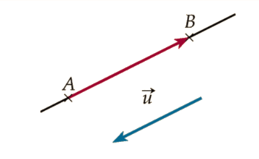
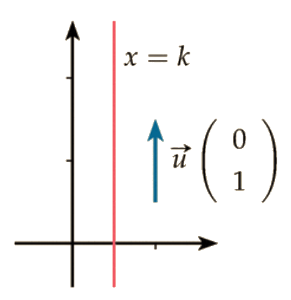
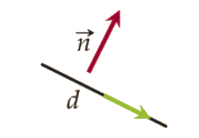

# Equation cartésienne du plan

!!! info "Equation de courbe"
    Une **équation de courbe** est une relation qui lie les coordonnées de tous les points de la courbe.
    
    Autrement dit : un point appartient à une courbe si et seulement si ses coordonnées vérifient l'équation de la courbe.

    ???- warning "Pas d'unicité"
        Une courbe peut avoir plusieurs équations.

        Par exemple, &laquo; $xy=4$ &raquo; et &laquo; $2xy=8$ &raquo; sont des équations de la même courbe.

## Equation de droite

### Equation réduite

!!! info "Equation réduite"
    Soit $(d)$, une droite dans un repère $(O;I,J)$.  
    
    - Si $(d)$ **est parallèle à l'axe des ordonnées** alors $(d)$ admet une équation de la forme $x=c$ où $c$ est un nombre réel. Cette équation est appelée **équation réduite**.
    - Si $(d)$ **n'est pas parallèle à l'axe des ordonnées** alors $(d)$ admet une équation réduite de la forme $y=mx+p$, $m$ et $p$ étant des nombres réels. Cette équation est appelée **équation réduite**.
    
    ???- tip "Cas non vertical"
        On retrouve l'équation réduite d'une fonction affine et donc [toutes les méthodes qui vont avec](../Fonctions/Fct_affine.md).
    
    ???- tip "Cas vertical"
        Comme le sous-entend l'équation réduite $x=c$, tous les points d'une droite verticale ont la même abscisse.

### Vecteur directeur

!!! info "Vecteur directeur"
    Un vecteur $\vv{u}$ non nul est un **vecteur directeur** de la droite $(AB)$ si $\vv{u}$ et $\vv{AB}$ sont colinéaires.

    Autrement dit, un vecteur non nul est appelé vecteur directeur d'une droite lorsqu'il a la même **direction** que cette droite.

    Toute droite admet une infinité de vecteurs directeurs, tous colinéaires entre eux.

    [{.Center_lien .Vignette20}](Image/vect_dir01.png)

!!! info "Conséquence immédiate"
    Deux droites sont parallèles si, et seulement si, un vecteur directeur de l'une est colinéaire à un vecteur directeur de l'autre.

???- tip "Rappel"
    Soit $\vv{u}\covec{x}{y}$ et $\vv{v}\covec{x'}{y'}$ deux vecteurs du plan.

    $\vv{u}$ et $\vv{v}$ sont colinéaires si, et seulement si, leurs **coordonnées sont proportionnelles**.

    Autrement dit, ils sont colinéaires si, et seulement si, $xy'-x'y=0$.

!!! info "Rappel ..."
    Soient $m$ et $p$ deux réels. Le vecteur $\vectCo{u}{1}{m}$ est un vecteur directeur de la droite d'équation $y=mx+p$.

!!! info "... et nouveauté"
    Soit $c$ un réel. Le vecteur $\vectCo{u}{0}{1}$ est un vecteur directeur de la droite d'équation $x=c$.

    [{.Center_lien .Vignette20}](Image/vect_dir02.png)

### Equation cartésienne

!!! info "Cas général"
    Soit $A$ un point du plan, $\vv{u}$ un vecteur non nul et $d$ la droite de vecteur directeur $\vv{u}$ passant par $A$.

    Un point $M$ appartient à $d$ si, et seulement si, $\vv{AM}$ et $\vv{u}$ sont colinéaires.

    L'ensemble des points $M(x\ ;\ y)$ du plan tels que $ax+by+c=0$ avec $(a\ ;\ b)\neq(0\ ;\ 0)$ est une droite de vecteur directeur $\vv{u}\left(\begin{array}{c} -b\\a \end{array}\right)$.

    ???- warning "Non tous nuls"
        $(a\ ;\ b)\neq(0\ ;\ 0)$ signifie que $a$ et $b$ ne peuvent pas être nuls simultanément.

    Et réciproquement : toute droite du plan admet une équation de la forme $ax+by+c=0$ avec $(a\ ;\ b)\neq(0\ ;\ 0)$ où $\vv{u}\covec{-b}{a}$ est un vecteur directeur de la droite.

    Une équation d'une droite $d$ de la forme $ax+by+c = 0$, avec $(a\ ;\ b)\neq(0\ ;\ 0)$ est appelée **une équation cartésienne** de la droite $d$.

## Vecteur normal

!!! info "Définition"

    Dire qu'un vecteur $\vec{n}$ est **normal** à une droite $(d)$ signifie que $\mathbf{\vec{n} \neq \vec{0}}$ et que la direction de $\vec{n}$ est orthogonale à celle de $(d)$. Ce qui revient à dire que $\vec{n}$ et $\vec{u}$, un vecteur directeur de $(d)$, sont orthogonaux.

    [{.Center_lien .Vignette20}](Image/vect_norm01.png)

!!! info "Equaiton cartésienne"
    Dans **un repère orthonormé**, si $(d)$ a pour équation $ax+by+c=0$ (où $(a;b) \neq (0;0)$), alors $\vectCo{n}{a}{b}$ est un vecteur normal de $(d)$.

    Réciproquement : si $\vectCo{n}{a}{b} \neq \covec{0}{0}$ est un vecteur normal de $(d)$, alors une équation cartésienne de $(d)$ est $ax+by+c=0$ (où $c\in \R$).

???- tip "Avec des équations réduites"

    - Si $(d)$ a pour équation réduite $y=mx+p$ alors un vecteur normal est $(-m;1)$.
    - Si $(d)$ a pour équation réduite $x=k$ alors un vecteur normal est $(1;0)$.

## Equation de cercle

!!! info "Avec un diamètre"
    On note $\repv$ un repère orthonormal. Soient $A(x_A;y_A)$ et $B(x_B;y_B)$ deux points distincts du plan. L'ensemble des points $M$ du plan tels que $\vect{AM} \cdot \vect{BM}=0$ est le cercle $\mc{C}$ de diamètre $[AB]$. Une équation cartésienne de $\mc{C}$ dans le repère $\repv$ est ;

    \[ (x-x_A)(x-x_B)+(y-y_A)(y-y_B)=0 \]

!!! info "Avec le centre et le rayon"
    On note $\repv$ un repère orthonormal. Soit $\Omega$ un point du plan et $R$ un réel strictement positif. Le cercle $\mc{C}$ de centre $\Omega$ et de rayon $R$ est l'ensemble des points $M$ du plan tels que $\Omega M=R$, ou encore $\Omega M^2=R^2$. Une équation cartésienne de $\mc{C}$ dans $\repv$ est :
    
    \[ (x-x_{\Omega})^2+(y-y_{\Omega})^2=R^2 \]

## Exercices

???- example "Exercice"
    Soit $A(1\ ;\ 2)$, $B(5\ ;\ 4)$ et $C(-1\ ;\ 6)$.

    La droite $(AB)$ est-elle parallèle à $d$, la droite passant par $C$ et de vecteur directeur $\vv{u}\covec{-2}{-1}$ ?

    ???- done "Solution"
        Le vecteur $\vv{AB}\covec{4}{2}$ est colinéaire à $\vv{u}$ puisque $\vv{AB}=-2\vv{u}$.

        Comme le vecteur $\vv{AB}$ est directeur de la droite $(AB)$ et le vecteur $\vv{u}$ est directeur de la droite $d$, les droites $(AB)$ et $d$ sont parallèles.

???- example "Exercice"
    Déterminer une équation cartésienne de la droite $d$ de vecteur directeur $\vv{u}\covec{-3}{2}$ passant par $A(-1\ ;\ 4)$.

    ???- done "Solution"
        Soit $M(x\ ;\ y)$, on a alors $\vv{AM}\covec{x-(-1)}{y-4}$ soit $\vv{AM}\covec{x+1}{y-4}$. Ainsi :

        \[
        \begin{eqnarray*}
        M\in d &\Leftrightarrow & \vv{AM} \text{ et } \vv{u} \text{ sont colinéaires} \\
        &\Leftrightarrow & (x+1)\times2-(-3)\times(y-4)=0 \\
        &\Leftrightarrow & 2x+2-(-3y+12)=0\\
        &\Leftrightarrow & 2x+3y-10=0.
        \end{eqnarray*}
        \]

        Une équation cartésienne de $d$ est donc $2x+3y-10=0$.

???- example "Exercice"
    On considère la droite $d$ d'équation $x-3y+1=0$.

    1. Déterminer un vecteur directeur de la droite $d$.
    1. Déterminer les coordonnées d'un point de $d$.

    ???- done "Solution"

        <ol>
        <li> Un vecteur directeur de $d$ est $\vv{u}\covec{-(-3)}{1}$ soit $\vv{u}\covec{3}{1}$.</li>
	    <li> On peut fixer une valeur pour une coordonnée et choisir ensuite l'autre pour que l'équation soit vérifiée.
	
	    Ainsi, si on fixe $y=0$ alors $x-3\times 0+1=0$ donc $x=-1$.
	
	    Le point $A(-1\ ;\ 0)$ est donc un point de $d$.
        </li>
        </ol>
    
???- example "Exercice"
    Dans un repère orthonormé, déterminer une équation cartésienne de la droite $d$ passant par $A(2\ ;\ -4)$ et de vecteur normal $\vv{n}\covec{5}{6}$.

    ???- done "Solution"
        Il y a deux façons de procéder.
        <ul>
        <li> Comme $\vv{n}\covec{5}{6}$ est normal à $d$, elle a pour équation $5x+6y+c=0$ où $c$ reste à déterminer.

        De plus, $A\in d$ donc $5x_A+6y_A+c=0\Leftrightarrow5\times 2+6\times (-4)+c=0\Leftrightarrow-14+c=0$

        $\Leftrightarrow c=14$ : la droite $d$ a donc pour équation $5x+6y+14=0$.
        </li>
        <li> $M(x\ ;\ y)\in d\Leftrightarrow \vv{AM}\cdot\vv{n}=0\Leftrightarrow (x-2)\times 5+(y+4)\times 6=0\Leftrightarrow5x+6y+14=0$. </li>
        </ul>

???- example "Exercice"
    Soit  $A(2\ ;\ 3)$ et $B(5\ ;-1)$ dans un repère orthonormé. 

    Déterminer  une équation de $\mathscr{C}$, le cercle de diamètre $[AB]$.

    ???- done "Solution"

        $M(x\ ;\ y)\in \mathscr{C}\Leftrightarrow \vv{MA}\cdot \vv{MB}=0$ or $\vv{MA}\covec{2-x}{3-y}$ et  $\vv{MB}\covec{5-x}{-1-y}$ donc :

        \[
        \begin{eqnarray*}
        M\in \mathscr{C} & \Leftrightarrow & (2-x)(5-x)+(3-y)(-1-y)=0\\
        & \Leftrightarrow & 10-2x-5x+x^2+(-3-3y+y+y^2)=0$\\
        & \Leftrightarrow & x^2-7x+y^2-2y+7=0
        \end{eqnarray*}
        \]

        $x^2-7x+y^2-2y+7=0$ est donc une équation de $\mathscr{C}$.