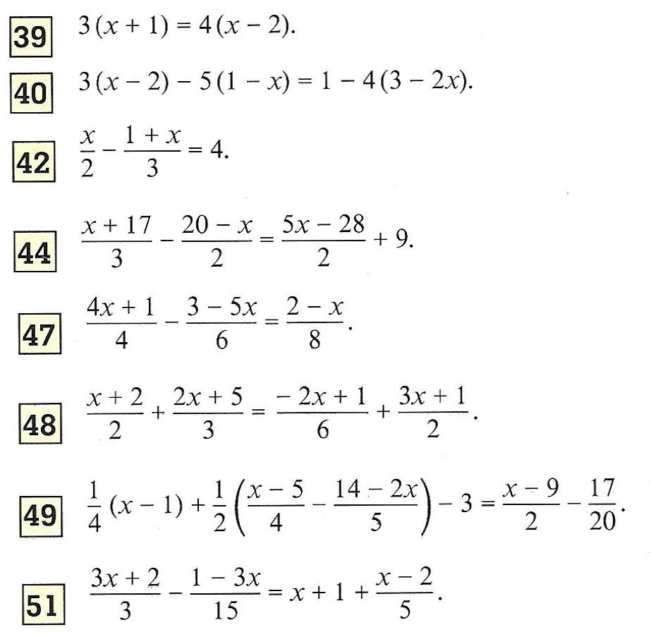
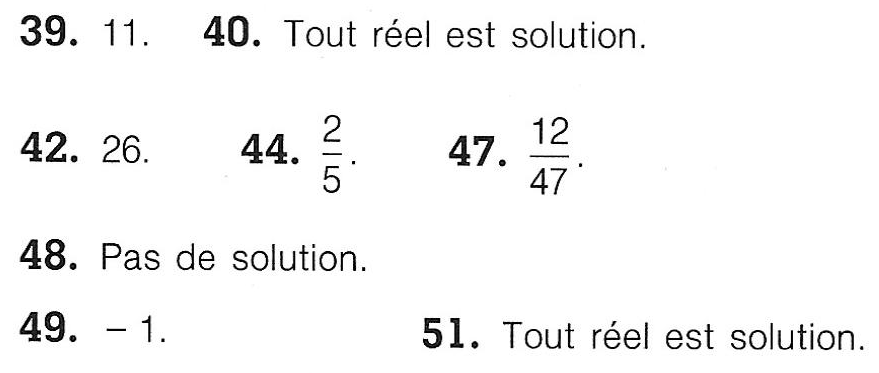
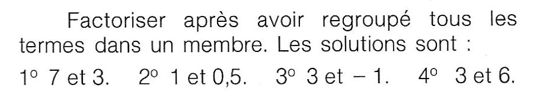
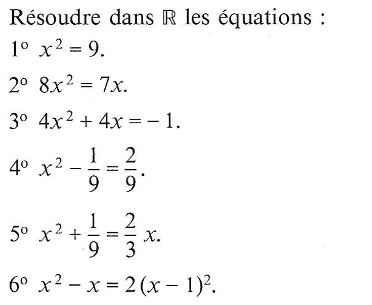
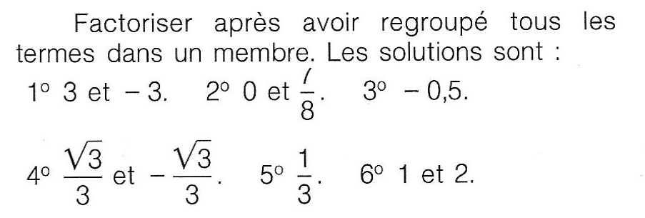

# Résolution d'équation

## Méthodes

!!! note "Equation &laquo; atomique &raquo;"

    Afin de résoudre une équation &laquo; atomique &raquo;, il faut isoler l'inconnu !

    Pour l'instant, les équations &laquo; atomiques &raquo; connues sont :
    <ul>
    <li>$ax+b=0$</li>
    <li>$a\ex^{x}+b=0$.</li>
    </ul>

    S'y ajoute le cas des équations du second degré $ax^2+bx+c=0$. Ces dernières peuvent se ramener à un produit de fonctions affines (en utilisant la forme canonique) ou à une somme de carré, somme strictement positive. Mais en pratique, vous utiliserez la méthode qui utilise le discriminant.

???- example "Exemple"
    Résoudre :
    <ol>
    <li>$3x-4=0$</li>
    <li>$5\ex^x-5=0$</li>
    </ol>

    ???- done "Solution"
        <ol>
        <li>$3x-4=0$ $\iff$ $x = \dfrac{4}{3}$</li>
        <li>$5\ex^x-5=0$ $\iff$ $\ex^x = 1$ $\iff$ $\ex^x = \ex^0$ $\iff$ $x = 0$</li>
        </ol>

!!! note "Méthode pour résoudre une équation non &laquo; atomique &raquo;"
    Pour résoudre une équation non &laquo; atomique &raquo; : 
    <ol>
    <li>il faut rechercher le domaine d'étude (il est parfois donné dans l'énoncé)</li>
    <li>puis, il faut se ramener à un membre  égal à 0</li>
    <li>ensuite, il faut factoriser et/ou réduire au même dénominateur (en essayant d'écrire tous les facteurs comme une expression atomique) </li>
    <li>enfin, on utilise les théorèmes suivants :
    <ul>
    <li>$a\times b =0$ $\iff$ $a = 0$ ou $b = 0$ </li>
    <li>$\dfrac{a}{b} =0$ $\iff$ $a = 0$ et $b \neq 0$ </li>
    </ul></li>
    </ol>

    Il faut donc savoir factoriser et réduire au même dénominateur !

## Equation du second degré

!!! note "Résolution d'équation du second degré"
    Le nombre de solutions de l'équation du second degré $ax^2+bx+c=0$ ($a \neq 0$) dépend du signe de $\Delta = b^2 - 4ac$. On note $f(x) = ax^2+bx+c$.

    <table class="AvecBordure">
    <tr><td></td><td>$\Delta{} >0$</td><td>$\Delta{} =0$</td><td>$\Delta{} <0$</td></tr>
    <tr><td>L'équation $ax^2+bx+c=0$</td><td>a deux solutions  $x_1$  et  $x_2$  :   $x_1=\dfrac{-b-\sqrt{\Delta}}{2a}$   
     $x_2=\dfrac{-b+\sqrt{\Delta}}{2a}$</td><td> a une solution   $x_0=\alpha{}=-\dfrac{b}{2a}$  </td><td> n'a pas de solution réelle </td></tr>
    <tr><td>La courbe représentative $C_{f}$</td><td>coupe l'axe des abscisses en deux points  $\left(x_1\ ;\ 0\right)$  et $\left(x_2\ ;\ 0\right)$</td><td>coupe l'axe des ordonnées en son sommet   $\left(x_0\ ;\ 0\right)$</td><td>ne coupe pas l'axe des abscisses</td>
    </tr>    
    <tr><td>Forme factorisée de $f$</td><td>$a\left(x-x_1\right)\left(x-x_2\right)$</td><td>$a{\left(x-x_0\right)}^2$</td><td>pas de factorisation dans $\R$</td></tr>
    </table>

!!! warning "Eviter le discriminant"
    Lorsqu'il est possible de résoudre une équation du second degré **sans** utiliser le discriminat, il serait préférable de ne pas utiliser le discriminant !

!!! abstract "Forme canonique"
    Il peut être utile de savoir retrouver la forme canonique d'une expression du second degré.
    
    \[
    \begin{eqnarray*}
    f \left( x \right) & = & {ax}^2+bx+c \\
     & = & a\left( x^2+\dfrac{b}{a}x \right) + c \\
     & = & a\left( \left(x+\dfrac{b}{2a}\right)^2-\dfrac{b^2}{\left(2a\right)^2}\right)+c \\
     & = & a \left(x+\dfrac{b}{2a}\right) ^2-\dfrac{b^2}{4a}+c
    \end{eqnarray*}
    \]

    On peut réécrire cette expression sous la forme
  
    $\begin{eqnarray*}
    f\left(x\right) &= & {ax}^2+bx+c\\
    & = & a{\left(x+\dfrac{b}{2a}\right)}^2+\dfrac{4ac-b^2}{4a}.
    \end{eqnarray*}$

    ???- tip "Utiliser différemment une technique connue"

        Pour trouver la forme canonique, il faut voir $x^2+\dfrac{b}{a}x$ comme le début d'une identité remarquable. 

        Mais, il est parfois indispensable de voir plutôt $x^2 + \dfrac{c}{a}$ comme le début d'une identité remarquable (mais cela **ne sera pas** la forme canonique !!).

!!! note "Somme et produit des racines"
    Soit $f(x) = ax^2+bx+c$ avec $a\neq 0$ et $\Delta\geq 0$. Si on note Ses racines $x_1$ et $x_2$ (elles sont éventuellement égales) alors

    \[
    x_1 + x_2 = \dfrac{-b}{a} \qquad\text{ et }\qquad x_1 \times x_2 = \dfrac{c}{a}
    \]

## Exercices

???- question "Exercice"

    [{.Center_lien .Vignette40}](Image/Ex00.png)

    ???- done "Solution"

        [{.Center_lien .Vignette30}](Image/SEx00.png)

???- question "Exercice"

    [{.Center_lien .Vignette30}](Image/Ex01.png)

    ???- done "Solution"

        [{.Center_lien .Vignette40}](Image/SEx01.png)

???- question "Exercice"

    [{.Center_lien .Vignette30}](Image/Ex02.png)

    ???- done "Solution"

        [{.Center_lien .Vignette40}](Image/SEx02.png)

???- question "Exercice"

    Mettre sous forme canonique les polyn\^{o}mes du second degré suivants.
    <ol>
    <li> $x^2+4x+1$</li>
    <li> $4x^2-3$</li>
    <li> $-2x^2+3x-6$ </li>
    <li> $x^2+6x$</li>
    </ol>

    ???- done "Solution"
        <ol>
        <li> $\left(x+2\right)^2-3$ </li>
        <li> $4x^2-3$ est sous forme canonique. </li>
        <li> $-2{\left(x-\dfrac{3}{4}\right)}^2-\dfrac{78}{16}$ </li>
        <li> $\left(x+3\right)^2-9$ </li>
        </ol>

???+ question "Exercice"
    Résoudre les équations suivantes dans $\mathbb{R}$ :
    <ol>
    <li> $\exp(x)=\ex$</li>
    <li> $\exp(-x)=1$</li>
    <li> $\exp(2x-1)=\ex$</li>
    <li> $\ex^{x^2+x}=1$</li>
    <li> $\ex^{x}-\ex^{-x}=0$</li>
    <li> $\ex^{x^2+5}=\left(\ex^{x+2}\right)^2$</li>
    <li> $\ex^x+\ex^{-x}=0$</li>
    <li> $\ex^{3x+1}=\ex^{-2x+3}$</li>
    <li> $\ex^{2x}-1=0$</li>
    <li> $x\ex^{2x}-2\ex^{2x}=0$
    </ol>
    
    ???- done "Solution"
        <ol>
        <li> $\{1\}$</li>
        <li> $\{0\}$</li>
        <li> $\{1\}$</li>
        <li> $\{-1;0\}$</li>
        <li> $\{0\}$</li>
        <li> $\{1\}$</li>
        <li> $\varnothing$</li>
        <li> $\{2/5\}$</li>
        <li> $\{0\}$</li>
        <li> $\{2\}$
        </ol>