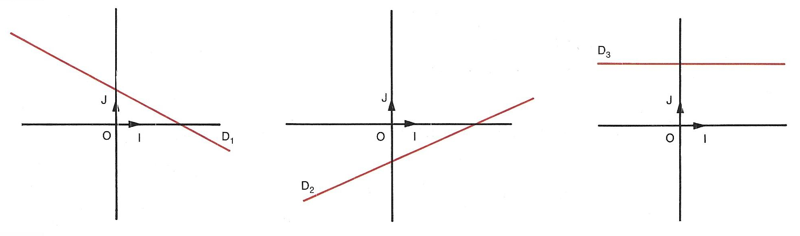
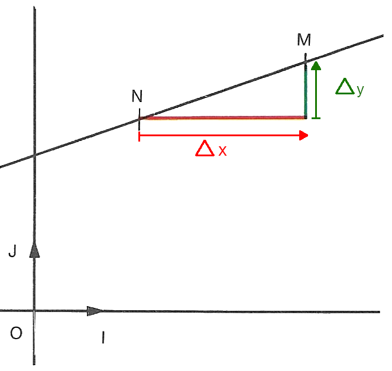
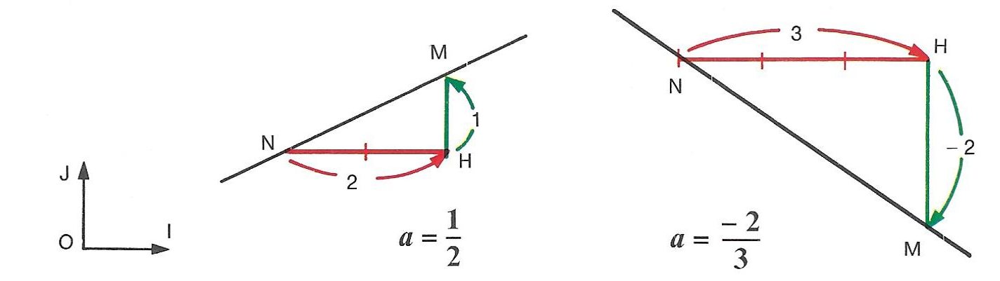

# Fonction affine

## Définition et vocabulaire

!!! info "Définition"
    Soient $m$ et $p$ deux réels.

    La fonction $\begin{array}{lrcl} f: & \R & \rightarrow & \R \\ & x & \mapsto & mx +p \end{array}$ est appelée **fonction affine**.

    La courbre représentative d'une fonction affine est une droite.

    - $m$ s'appelle **le coefficient directeur** de la fonction affine ou de la droite associée.
    - $p$ s'appelle **l'ordonnée à l'origine** de la fonction affine ou de la droite associée.

    ???- note "Remarques"
        
        - Une fonction affine est souvent notée $f(x) = ax + b$, avec $a$ et $b$ deux réels
        - Une fonction affine est un polynôme. Si $m\neq 0$, alors $f(x) = mx+p$ est un polynôùe de degré 1.

???+ example "Exemple"
    - Les fonctions $f(x) = \dfrac{x}{3} - 2$ et $g(x) = 5$ sont des fonctions affines.
    - Les fonctions $h(x) = x^2-2$ et $l(x) = \dfrac{2}{x} - 3$ *ne sont pas* des fonctions affines.

    $D_1, D_2$ et $D_3$ sont les représentations graphiques de fonctions affines.

    [{.Center_lien .Vignette60}](Image/Courbe01.png)

???- info "Vocabulaire des cas particuliers"
    Soit $f(x) = mx+p$ une fonction affine (elle est donc obligatoirement définie sur $\R$).

    - Si $m=0$, c'est-à-dire $f(x) = p$, alors $f$ est **une fonction constante**. Dans ce cas, sa courbe représentative est une **droite horizontale** (ou mieux : parallèle à l'axe des abscisses).
    - Si $p=0$, c'est-à-dire $f(x) = mx$, alors $f$ est **une fonction linéaire**. Dans ce cas, sa courbe représentative est **une droite passant par l'origine**. Une telle fonction décrit une situation de proportionnalité entre les images et les abscisses associées.

!!! info "Equation réduite"
    On appelle **équation réduite d'une droite non verticale** (ou équation réduite associée à une fonction affine), l'équation 
    
    \[
    \mathbf{y = mx + p}
    \]

    ???- tip "Unicité"
        Une telle équation réduite est **unique**..

    ???- tip "Equation cartésienne et vecteur directeur"
        L'équation cartésienne associée à une telle fonction affine est donc 

        \[
        mx - y + p = 0
        \]

        Donc un vecteur directeur d'une telle droite est $\vect{u} = (1; m)$

## Le coefficient directeur

!!! note "Déterminer un coefficient directeur par le calcul"
    Dans une repère, on a $A(x_A;y_A)$ et $B(x_B;y_B)$ deux points tels que $\mathbf{x_A \neq x_B}$, alors le coefficient directeur $m$ de la droite passant par $A$ et $B$ (c'est donc la droite $(AB)$), on calcule :

    \[
     m = \dfrac{y_{\textcolor{red}{B}}-y_A}{x_{\textcolor{red}{B}}-x_A} \qquad\text{ ou }\qquad m = \dfrac{y_{\textcolor{red}{A}}-y_B}{x_{\textcolor{red}{A}}-x_B}
    \]

!!! note "Déterminer un coefficient directeur graphiquement"
    Dans une repère, on détermine graphiquement $M(x_M;y_N)$ et $N(x_N;y_N)$ deux points tels que $\mathbf{x_M \neq x_N}$, alors le coefficient directeur $m$ de la droite passant par $M$ et $N$ (c'est donc la droite $(MN)$), on calcule :

    \[
    m = \dfrac{\Delta{} y}{\Delta{} x} = \dfrac{y_M-y_N}{x_M-x_N}
    \]

    [{.Center_lien .Vignette20}](Image/coef_dir.png)

    ???- tip "Vecteur directeur"
        Ainsi un vecteur directeur de la droite associée à une fonction affine est $\vect{u}=(\Delta x;\Delta y) = \Delta x \times (1; m)$.

???- example "Exemple"
    Déterminer graphiquement le coefficient directeur $a$ des droites :

    [{.Center_lien .Vignette60}](Image/coef_dir01.png)

## Déterminer une fonction affine

!!! note "Méthode pour déterminer une fonction affine"

    <ul>
    <li> Déterminer une fonction affine à partir de deux points $A(x_A;y_A)$ et $B(x_B;y_B)$ tels que $y_A \neq y_B$:
        <ul class="Sous_liste">
        <li> Etape 1 : déterminer le coefficient directeur $m = \dfrac{y_B-y_A}{x_B-x_A}$</li>
        <li> Etape 2 : Puis utiliser la formule

    \[
    f(x) = m \times (x-x_A) + y_A
    \]

    </li>
    </ul>
    </li>
    <li>Déterminer une fonction affine à partir d'un point $A(x_A;y_A)$ et d'un coefficient directeur $m$ :
    
    Il suffit d'utiliser la formule

    \[
    f(x) = m \times (x-x_A) + y_A
    \]

    </li>
    </ul>

???- example "Exemple"
    Déterminer la fonction affine passant par $R(2;3)$ et $T(-1;4)$.

    ???- done "Solution"
        - Calcul du coefficient directeur $m = \dfrac{y_R-y_T}{x_R-x_T} = \dfrac{3 - 4}{ 2 - (-1)} = \dfrac{-1}{3}$
        - Utilisation de la formule :

        \[
        \begin{eqnarray*}
        f(x) & = & \dfrac{-1}{3}(x - x_R) + y_R\\
        & = & \dfrac{-1}{3}(x-2) + 3 \\
        & = &  \dfrac{-1}{3}x + \dfrac{11}{3}
        \end{eqnarray*}
        \]