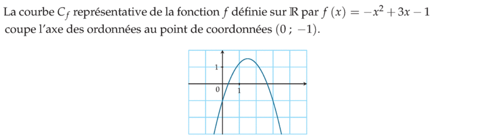
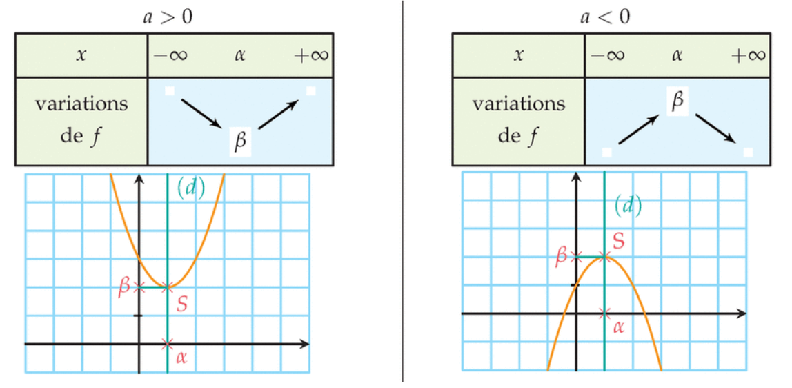
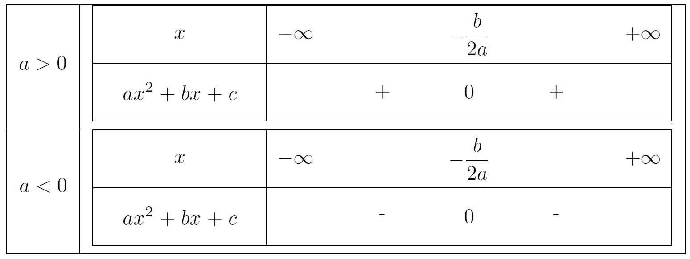
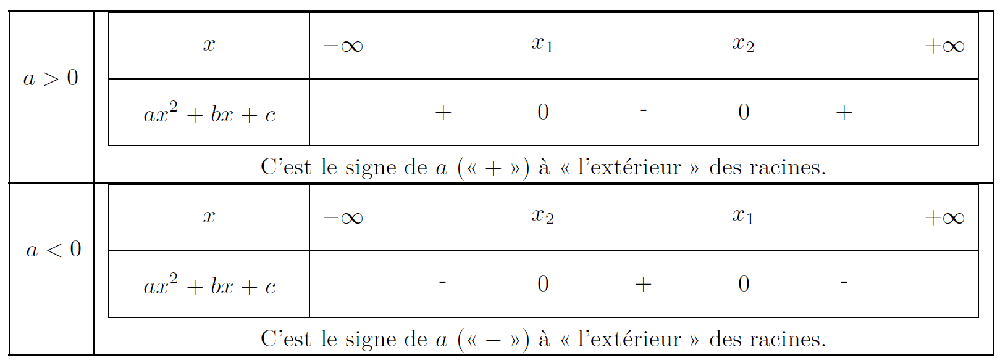
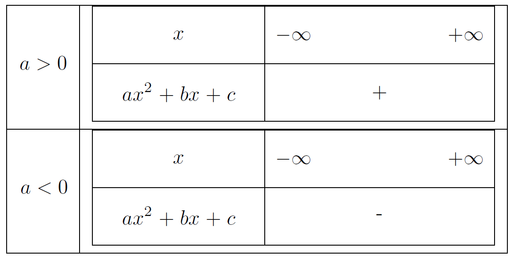

# Fonction du second degré

## Définition et vocabulaire

!!! info "Définition"
    Toute fonction $f$ définie sur $\R$ par $f(x) = ax^2 + bx + c$ sont des réels avec $a\neq0$ est appelée **fonction polynôme du second degré** ou, simplement, fonction du second degré.

???- note "Vocabulaire"
    
    - L'expression algébrique $ax^2+b+x+c$, où $a,b$ et $c$ sont des réels avec $a\neq 0$ est appelée **trinôme du second degré** et l'écriture $f(x) =ax^2+bx+c$ est appelée **forme développée**.
    - La courbe représentative d'une fonction du second degré est appelée **une parabole**. On peut aussi dire que la parabole a pour équation $y=ax^2+bx+c$.
    - Une parabole, et donc une fonction du second degré, est totalement déterminée par la donnée de 3 points non alignés.

???- tip "Intersection avec l'axe des ordonnées"
    Comme $f(0) = c$, le point d'intersection d'une parabole avec l'axe des ordonnées est le point $(0;c) !

    [{.Center_lien .Vignette60}](Image/exple01.png)

## Forme canonique

!!! info "Forme canonique"
    Toute fonction $f$ du second degré définie sur $\R$ par $f(x) = ax^2+bx+c$ (avec $a \neq 0$) peut s'ecrire de façon unique sous la forme $f(x) = a(x - \alpha)^2 + \beta$ où $\left\{ \begin{array}{rlc} \alpha & = & -\dfrac{b}{2a} \\ \beta & = & f(\alpha) \end{array}\right.~$

    Cette forme est appelée **la forme canonique**. 
    
    La courbe représentative de $f$ est une parabole de sommet $S(\alpha; \beta)$.

???- example "Exemple"
    Soit $f$ la fonction du second degré définie sur $\R$ par
    $f\left(x\right)=-x^2+3x-1$. 

    Déterminer sa forme canonique.

    ???- done "Solution"
        La forme développée de $f$ a pour coefficients $a=-1$, $b=3$ et $c=-1$. 

        On obtient $\alpha{} = -\dfrac{b}{2a} = \dfrac{3}{2}$ et $\beta{} =
        f\left(\dfrac{3}{2}\right) =-
        {\left(\dfrac{3}{2}\right)}^2+\dfrac{3\times{}3}{2}-1 =
        \dfrac{5}{4}$.

        La forme canonique de $f$ est donc $f\left(x\right)=-{\left(x-\dfrac{3}{2}\right)}^2+\dfrac{5}{4}$ et la courbe représentative de $f$ est donc une parabole de sommet
        $S\left(\dfrac{3}{2}\ ;\ \dfrac{5}{4}\right)$.

???- tip "Axe de symétrie"
    Une parabole de sommet $S(\alpha; \beta)$ est symétrique par rapport à la droite d'équation $x = \alpha$.

## Variations

!!! info "Tableau de variations"
    Soit $f$ une fonction du second degré dont la forme canonique est $f(x) = a(x-\alpha)^2 + \beta$, avec $a \neq 0$ et $\alpha = \dfrac{-b}{2a}$.

    **Le sens de variations de $f$ dépend du signe de $\mathbf{a}$ !**

    [{.Center_lien .Vignette60}](Image/Var01.png)

## Equations et inéquations

Pour les équations, [aller ici](../Equation/Equation.md#sol_sec_deg).

Pour résoudre des inéquations, il peut êter utile de connaitre le tableau de signes d'une fonction du second degré.

!!! info "Tableau de signes d'un second degré"
    Etude du signe de $ax^2+bx+c$

    <ul>
    <li>
    Si $\Delta{} = 0$, $ax^2+bx+c = a \left( x + \dfrac{b}{2a} \right)^2$ est du signe de $a$, sauf en $\dfrac{-b}{2a}$, où l'expression est nulle. D'où les tableaux de signe suivants :

    [{.Center_lien .Vignette60}](Image/Signe01.png)</li>
    <li> Si $\Delta >0$, 
    
    ???- abstract "La forme factorisée"
    
        \[
        \begin{eqnarray*} 
        ax^2+bx+c & = & a \left[ x+\frac{b}{2a}  - \frac{\sqrt{\Delta}}{2a} \right] \left[ x+\frac{b}{2a}  + \frac{\sqrt{\Delta}}{2a} \right] \\
        & = & a \left[ x - \left(\frac{-b}{2a}  + \frac{\sqrt{\Delta}}{2a} \right) \right] \left[ x - \left( \frac{-b}{2a}  - \frac{\sqrt{\Delta}}{2a} \right) \right] \\
        & = & a \left[ x - \frac{-b+\sqrt{\Delta}}{2a} \right] \left[ x - \frac{-b-\sqrt{\Delta}}{2a} \right] \\  
        & = & a \left( x - x_2 \right) \left( x - x_1 \right) 
        \end{eqnarray*}
        \]

    En notant $x_1 = \frac{-b-\sqrt{\Delta}}{2a}$ et $x_2 = \frac{-b+\sqrt{\Delta}}{2a}$, on a les tableaux de signe suivants :

    [{.Center_lien .Vignette60}](Image/Signe02.png)

    On démontre facilement que si $a>0$, alors $x_1 < x_2$ et si $a<0$, alors $x_2 < x_1$.

    ???- abstract "En effet ..."
        Comme $\sqrt{\Delta}>0$, 
        
        - $-\sqrt{\Delta} < 0$ donc $-b-\sqrt{\Delta} < -b$
        - $\sqrt{\Delta} > 0$ donc $-b+\sqrt{\Delta} > -b$

        Donc $-b-\sqrt{\Delta} < -b < -b+\sqrt{\Delta}$.

        Ainsi,
        
        - si $a>0$, $\dfrac{-b-\sqrt{\Delta}}{2a} < \dfrac{-b}{2a} < \dfrac{-b+\sqrt{\Delta}}{2a}$ et ainsi $x_1 < x_2$
        - si $a<0$, $\dfrac{-b-\sqrt{\Delta}}{2a} > \dfrac{-b}{2a} > \dfrac{-b+\sqrt{\Delta}}{2a}$ et ainsi $x_1 > x_2$
    </li>
    <li>  Si $\Delta<0$, alors  $ax^2+bx+c = a \underbrace{\left( \left( x + \frac{b}{2a} \right)^2 -  \underbrace{\frac{\Delta}{4a^2}}_{<0} \right)}_{>0}$ est donc toujours du signe de $a$.

    [{.Center_lien .Vignette40}](Image/Signe03.png)
    </li>
    </ul>

## Exercices

???- example "Exercice"
    Résoudre les inéquations du second degré suivantes dans $\R$.
    <ol>
    <li> $x^2+x-2>0$</li>
    <li> $-3x^2+x-2\leq{}0$</li>
    <li> $2x^2+3x\geq{}0$</li>
    <li> $2x^2-8<0$ </li>
    </ol>

    ???- done "Solution"

        <ol>
        <li> $S=\left]-\infty{}\ ;\ -2\right[\cup{}\left]1\ ;\ +\infty{}\right[$</li>
        <li> $S=\R$</li>
        <li> $S=\left]-\infty{}\ ;\ -\dfrac{3}{2}\right[\cup{}\left]0\ ;\ +\infty{}\right[$</li>
        <li> $S=\left]-2\ ;\ 2\right[$</li>
        </ol>