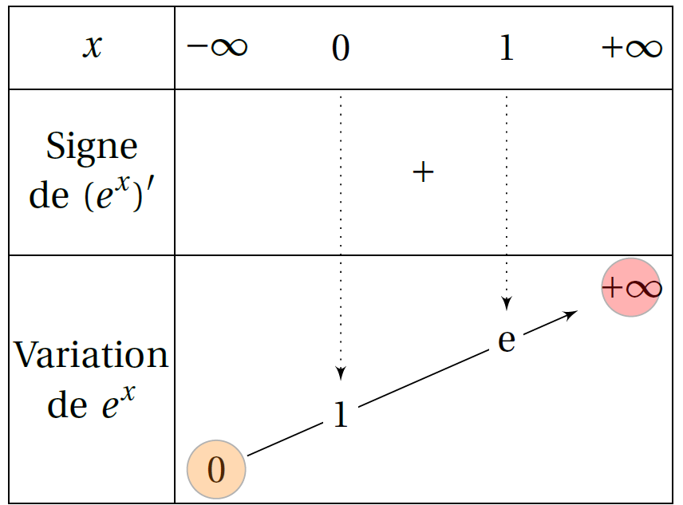
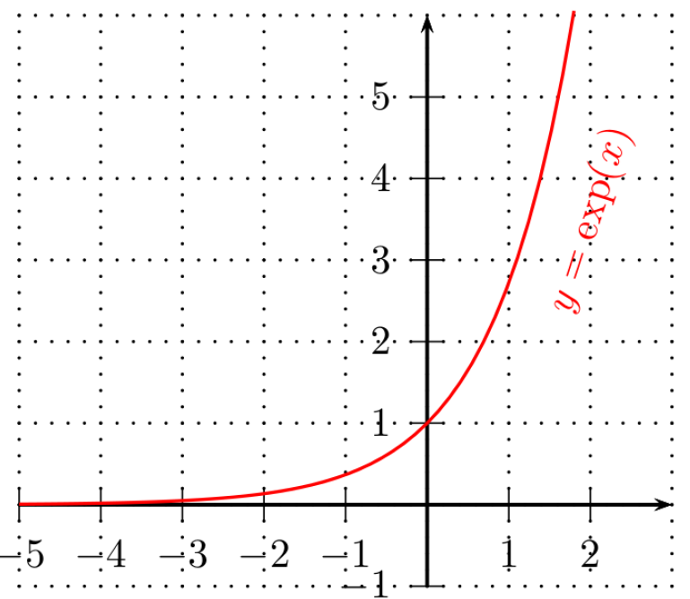

# Fonction exponentielle

## Premières propriétés

### Définition

!!! info "Définition"
    Il existe une unique fonction $f$ dérivable sur $\R$ telle que  $f'=f$ et $f(0)=1$.

    Cette fonction s'appelle la **fonction exponentielle**. Elle  est notée $\exp$. 

!!! note "Conséquences"
    La fonction exponentielle est l'unique fonction qui vérifie: 

    - $\exp(0)=1$ 
    - pour tout réel $x$, $\exp'(x)=\exp(x)$
    - pour tout réel $x$ , $\exp(x) \neq 0$

### Propriétés

!!! info "Propriétés algébrique"

    Pour tous réels $x$ et $y$, 
    
    - $\exp(x+y)=\exp(x)\times \exp(y)$
    - $\exp(-x)=\dfrac{1}{\exp(x)}$.
	- $\exp(x-y)=\dfrac{\exp(x)}{\exp(y)}$.
	- Pour tout entier relatif $p$, $\exp(px)=(\exp(x))^p$

???- tip "Notation puissance"
    On note $e$ le nombre tel que $\exp(1)=e$.

    En utilisant [la dernière relation du paragraphe précédent](#exp_puis), pour $x=1$,  $\exp(p)=\exp(p\times1)=(\exp(1)^p)=e^p$ pour tout $p\in\Z$.

    On prolonge cette écriture à tout réel $x$ et on note : pour tout $x$ de $\R$, $\exp(x)=e^x$.

???- tip "Propriété avec la notation puissance"

    - $e^0=1$ ; $e^1=e$
    - pour tout $x$ de $\R$\quad$e^{-x}=\dfrac{1}{e^x}$
    - pour tout $x$ de $\R$ et tout $y$ de $\R$, $e^{x+y}=e^x\times e^y$
    - pour tout $x$ de $\R$ et tout $y$ de $\R$, $e^{x-y}=\dfrac{e^x}{e^y}$
    - pour tout $x$ de $\R$ et tout entier relatif $p$, $(e^x)^p=e^{p\times x}$.

## Etude de la fonction exponentielle

!!! info "Fonction exponentielle"

    La fonction exponentielle est
    
    - dérivable donc continue sur $\R$ et (exp)'(x) = exp(x) 
    - strictement positive sur $\R$ 
    - strictement croissante sur $\R$.

    [{.Center_lien .Vignette20}](Image/exp_var01.png)

    [{.Center_lien .Vignette20}](Image/exp_courbe01.png)

???- tip "Comparaison avec 1"

    - $x<0\iff 0<e^x<1$
    - $x=0 \iff e^x=1$
    - $x>0 \iff e^x>1$

!!! info "Dérivée particulière"

    Pour tous réels $a$ et $b$, la fonction $f : \left\{ \begin{array}{rcl} \R & \rightarrow & \R\\ x & \mapsto & \exp(ax+b) \end{array} \right.$ est dérivable sur $\R$ et 

    \[
    f'(x) = a \times \exp(ax+b) \qquad\text{ ou } \qquad f'(x) = a \times \ex^{ax+b}
    \]

## Equations et inéquations

!!! info "Propriétés"
    On déduit du sens de variation de la fonction $\exp$.

    - Pour tous réels $x$ et $y$, $e^x < e^y$ équivaut à $x<y$.
    - Pour tous réels $x$ et $y$, $e^x=e^y$ équivaut à $x=y$.