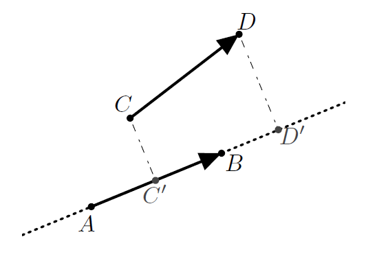

# Produit scalaire

## Définition et formules

### Des formules

!!! info "Définition"
    Le produit scalaire  de $\vec{u}$ et de $\vec{v}$, noté $\vec{u} \cdot \vec{v}$, est un **nombre réel** défini par $\frac{1}{2} \left( \| \vec{u} + \vec{v} \|^2 - \| \vec{u} \|^2 - \| \vec{v} \|^2 \right)$.

    \[
    \vec{u} \cdot \vec{v} = \frac{1}{2} \left( \| \vec{u} + \vec{v} \|^2 - \| \vec{u} \|^2 - \| \vec{v} \|^2 \right)
    \]

!!! info "Premières conséquences"
    <ul>
    <li> $\vec{u} \cdot \vec{v} = \vec{v} \cdot \vec{u}$</li>
    <li> Si $\vec{u}=\vec{0}$ ou $\vec{v}=\vec{0}$, alors $\vec{u} \cdot \vec{v}=0$. La réciproque est fausse.</li>
    </ul>

!!! note "Une notation bien pratique"
    Par convention, on note $\vec{u}^2=\vec{u} \cdot \vec{u}$. C'est une notation cohérente, car :

    \[
    \begin{eqnarray*}
    \vec{u} \cdot \vec{u} & = & \frac{1}{2} \left( \|2 \vec{u} \|^2 - 2 \| \vec{u} \|^2 \right) \\
    & = & \frac{1}{2} \left( 4\| \vec{u} \|^2 - 2 \| \vec{u} \|^2 \right) \\
    & = & \| \vec{u} \|^2
    \end{eqnarray*}
    \]

!!! info "Formule avec des coordonnées"
    Dans un **repère orthonormal**, $\vec{u}$ et $\vec{v}$ ont pour coordonnées respectives $(x;y)$ et $(x';y')$, alors 

    \[
    \vec{u} \cdot \vec{v} = xx' + yy'
    \]

!!! info " "
    Si $\vec{u}$ et $\vec{v}$ sont deux vecteurs non nuls, alors

    \[
    \vec{u} \cdot \vec{v} = \| \vec{u} \| \times \| \vec{v}\| \times \cos (\vec{u};\vec{v})
    \]

!!! info "Cas particuliers"
    Si $\vec{u}$ et $\vec{v}$ sont colinéaires :
    <ul>
    <li> si $\vec{u}$ et $\vec{v}$ sont de même sens, alors $\vec{u} \cdot \vec{v} = \| \vec{u} \| \times \| \vec{v}\|$.</li>
    <li> si $\vec{u}$ et $\vec{v}$ sont de sens contraires, alors $\vec{u} \cdot \vec{v} = - \| \vec{u} \| \times \| \vec{v}\|$.</li>
    </ul>

### Produit scalaire et orthogonalité.

!!! info "Orthogonalité"
    
    Dire que deux vecteurs $\vec{u}$ et $\vec{v}$ sont orthogonaux signifie que :
    <ul>
    <li> $\vec{u}=\vec{0}$ ou $\vec{v}=\vec{0}$</li>
    <li> $(OA)$ et $(OB)$  sont perpendiculaires (où $\vec{u} = \overrightarrow{OA}$ et $\vec{v} = \overrightarrow{OB}$ sont non nuls) et dans ce cas $(\vec{u};\vec{v})= \frac{\pi}{2} \quad [2\pi]$ ou $(\vec{u};\vec{v})= -\frac{\pi}{2} \quad [2 \pi ]$. </li>
    </ul>

!!! info "Propriétés"
    Dire que $\vec{u}$ et $\vec{v}$ sont orthogonaux équivaut à dire que $\vec{u} \cdot \vec{v} = 0$.

!!! info "Conséquence"
    Dans **un repère orthonormé**, $\vec{u}(x;y)$ et $\vec{v}(x';y')$ sont orthogonaux équivaut à 
    $xx'+yy'=0$

!!! info "Projeté orthogonal"
    Soient $B$ un point et $(d)$ une droite. Le projeté orthogonal de $B$ sur $(d)$ est le point $H$ de $(d)$ tel que $(BH)$ et $(d)$ soient perpendiculaires.

    En utilisant le théorème de Pythagore, pour tout point $M$ de $(d)$, $BM \geq BH$.

!!! info "Utilisation du projeté orthogonal"
    $\overrightarrow{AB}$ et $\overrightarrow{CD}$ sont deux vecteurs. $C$ se projette orthogonalement en $C'$ sur la droite $(AB)$. Alors :

    \[
        \overrightarrow{AB} \cdot \overrightarrow{AC} = \overrightarrow{AB} \cdot \overrightarrow{AC'}
    \]

    Plus généralement : $\overrightarrow{AB}$ et $\overrightarrow{CD}$ sont deux vecteurs. $C$ et $D$ se projettent orthogonalement en $C'$ et $D'$ sur la droite $(AB)$. Alors :
    
    \[
    \overrightarrow{AB} \cdot \overrightarrow{CD} = \overrightarrow{AB} \cdot \overrightarrow{C'D'}
    \]

    [{.Center_lien .Vignette20}](Image/Proj01.png)

    Si $\vec{u}=\vect{AB}$ et $\vec{v}=\vect{AC}$ et si $H$ est le projeté orthogonal de $C$ sur $(AB)$, alors :
    
    \[
    \vec{u} \cdot \vec{v} = \vect{AB} \cdot \vect{AC} = \left\{ \begin{array}{ll} AB \times AH & \text{ si } \vect{AB} \text{ et } \vect{AH} \text{ sont de même sens}\\ -AB \times AH & \text{ si } \vect{AB} \text{ et } \vect{AH} \text{ sont de sens contraire} \end{array} \right.
    \]

### Règles de calcul.

!!! info "Symétrie, linéarité"
    Pour tous vecteurs $\vec{u},\vec{v}$ et $\vec{w}$ et pour tous réels $a$ et $b$ :
    <ul>
    <li> $\vec{u} \cdot \vec{v} = \vec{v} \cdot \vec{u}$ (rappel)</li>
    <li> $\vec{u} \cdot \left( \vec{v} + \vec{w} \right) = \vec{u} \cdot \vec{v}+ \vec{u} \cdot \vec{w}$</li>
    <li> $(a\vec{u}) \cdot (b\vec{v}) = (ab)(\vec{u} \cdot \vec{v})$</li>
    </ul>

!!! info "Conséquences"

    <ul>
    <li> $\vec{-u} \cdot \vec{v} = -(\vec{u} \cdot \vec{v})$ et donc 
    
    \[
    \begin{eqnarray*}
    \overrightarrow{AB} \cdot \overrightarrow{CD} & = & -\overrightarrow{BA} \cdot \overrightarrow{CD} \\
    & = & -\overrightarrow{AB} \cdot \overrightarrow{DC}\\
    & = &  \overrightarrow{BA} \cdot \overrightarrow{DC}
    \end{eqnarray*}
    \]

    </li>
    <li> $(\vec{u}+\vec{v}) \cdot (\vec{u'} + \vec{v'}) = \vec{u} \cdot \vec{u'} + \vec{u} \cdot \vec{v'} + \vec{v} \cdot \vec{u'} + \vec{v} \cdot \vec{v'}$</li>
    </ul>

???- warning "Attention : si semblable et pourtant si différent !"
    Les calculs  sont très semblables à ceux avec la multiplication. Mais il y a **une grande différence**, le produit scalaire ne possède pas d'opération inverse (la division est l'opération inverse de la multiplication) et donc l'affirmation suivante est en général fausse :
    
    \[
        \text{FAUX!!FAUX!! } \vec{u} \cdot \vec{v} = \vec{u} \cdot \vec{w} \text{ alors } \vec{v} = \vec{w} \text{ FAUX!!FAUX!! }
    \]

???- tip "Une analogie bien utile"
    Par contre, avec la notation $\vec{u}^2=\vec{u} \cdot \vec{u}$, on retrouve une notation analogue aux identités remarquables :
    
    \[
    \begin{eqnarray*}
    (\vec{u} + \vec{v})^2 & = & (\vec{u}+ \vec{v}) \cdot (\vec{u}+\vec{v}) \\
    & =& \vec{u}^2+2\times \vec{u} \cdot \vec{v} + \vec{v}^2 \\
    (\vec{u} - \vec{v})^2 & = & (\vec{u}- \vec{v}) \cdot (\vec{u}-\vec{v}) \\
    & =& \vec{u}^2-2\times \vec{u} \cdot \vec{v} + \vec{v}^2 \\
    (\vec{u}+ \vec{v}) \cdot (\vec{u} - \vec{v}) & = &  \vec{u}^2 - \vec{v}^2 \\
    \end{eqnarray*}
    \]