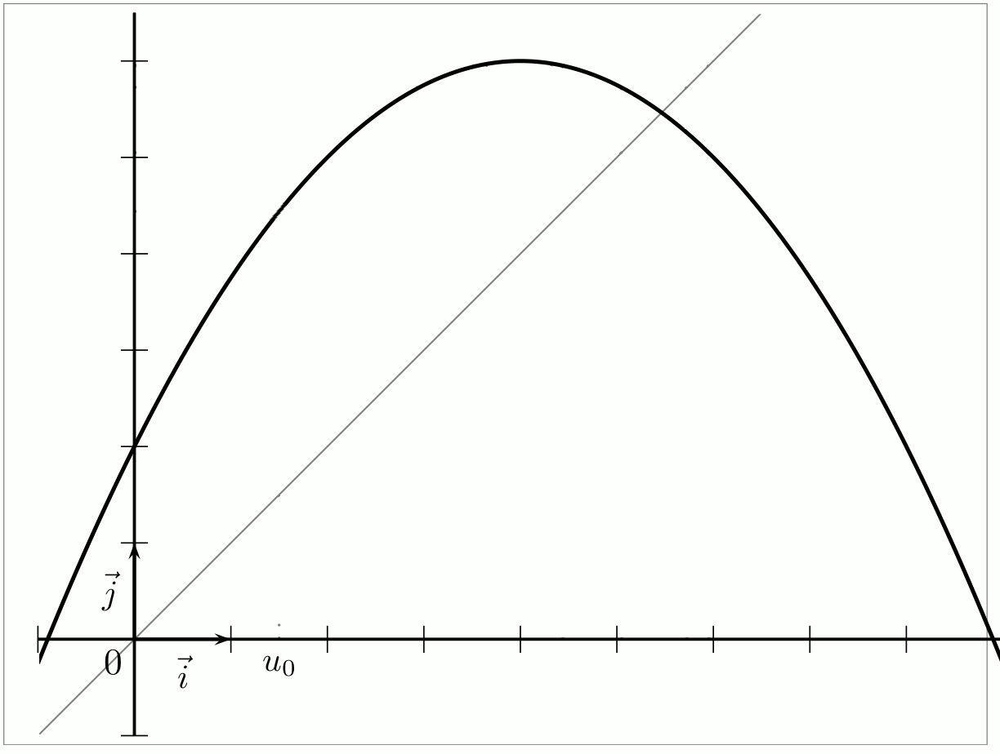
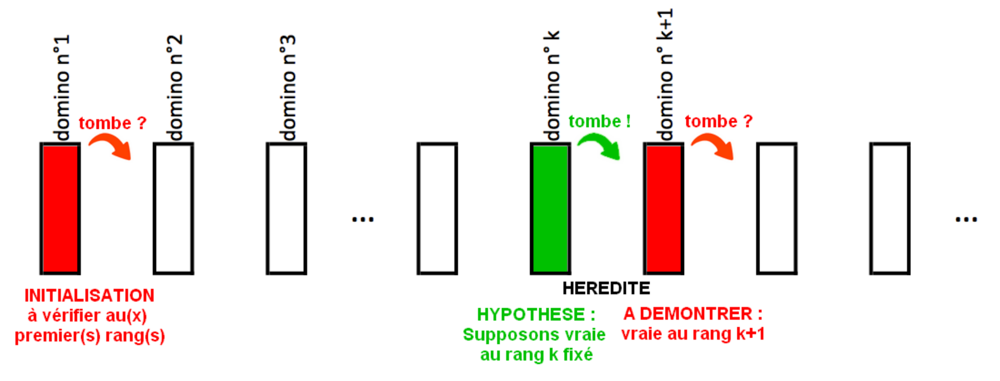

# Rappels sur les suites

## Définition

!!! Définition
	Une suite notée $u$ ou ($u_n$) est une fonction  dans laquelle  la variable $n$ ne prend que des valeurs entières positives.
	A chaque entier naturel $n$ on associe un nombre réel $u(n)$ image de l'entier $n$ par $u$, notée $u_n$, appelée terme d'indice $n$ ou  terme général de la suite $(u_n)$.

!!! warning
	**Attention bien faire la différence entre le terme général $u_n$ et la suite ($u_n$).**

## Modes de génération d'une suite 

!!! tip "Méthode"
	On peut définir une suite de **façon explicite**  en fonction de $n$ : $\mathbf{u_n=f(n)}$

??? question "Exercice"
	Soit $(u_n)$ la suite définie par $u_n=-5+7n$ pour $n \geqslant0$.</br>
	Ici $u_n=f(n)$.
	
	1. Déterminer $f$.
	2. Calculer $u_0$, $u_1$, $u_2$, $u_6$

	??? done "Solution"
		1. $f(x)=-5+7x$ 
		2. 
		
			* $u_0=-5+7\times0=-5$		
			* $u_1=-5+7\times1=2$
			* $u_2=-5+7\times2=9$
			* $u_6=-5+7\times6=37$
		   
<div class="SautDePage"></div>
	   
!!! tip "Méthode"
	On peut définir une suite de **façon récurrente**  du type

	\begin{array}{lcl}
	  u_{0} & = & a \\
	  u_{n+1}  & = &  f(u_n)
	\end{array}

	La suite est définie par la donnée de son premier terme et d'une relation de récurrence entre un terme et 
	le terme suivant )

??? question "Exercice"
	Soit $(u_n)_{n \in \mathbb{N}}$ la suite définie par :

	\[
	\left\{
	\begin{array}{lcl}
	  u_{0} & = & 4 \\
	  u_{n+1}  & = &  0.75 u_n+2
	\end{array}
	\right.
	\]
	
	1. Déterminer $f$ telle que $u_{n+1}=f(u_n)$
	2. Calculer $u_1$, $u_2$, $u_3$. Et pour $u_{100}$, qu'en pensez-vous ?

	??? done "Solution"
		1. Ici $u_{n+1} =f(u_n)$ avec $f(x)=-2x+1$
		2. 
		
			* $u_1=0.75u_0+2=0.75\times4+2=5$
			* $u_2=0.75u_1+2=0.75\times(5)+2=5.75$
			* $u_3=0.75u_2+2=0.75\times5.75+2=6,3125$

		L'inconvénient est que des termes "éloignés" du début de la suite sont difficiles d'accès: pour calculer
		$u_{100}$ il faut, a priori, calculer tous les termes précédents, jusqu'à $u_{99}$ !!
	
Il sera parfois nécessaire d'utiliser un programme afin de calculer des termes éloignées.
		   
<div class="SautDePage"></div>

!!! tip "Méthode"
	On peut encore définir une suite par l’intermédiaire d’une autre suite ou par une somme de termes, etc. . .
	
	Par exemple :
	
	* $(u_n)$ étant définie, on définit la suite ($v_n$) par : $v_n = u_n- 4$
	* On définit la suite ($w_n$) pour tout $n\in \mathbb{N}^*$ par : 
	
	\[
	w_n =  \sum_{i=1}^n \dfrac{1}{i} =1+\dfrac12+\dfrac13+\cdots+\dfrac{1}{n}
	\]

## Représentation graphique d'une suite

### La suite est définie de façon explicite

On peut representer une telle suite sur une droite (avec donc des points de coordonnées $(u_n;0)$) ou dans 
un plan avec des points de coordonnées $(n;u_n)$.

 
Suite $u_n=\sqrt{n}$ sur une droite : [{.VCenter .Vignette}](../Image/Cours_001.png)

Suite $u_n=\sqrt{n}$ dans un plan : [{.VCenter .Vignette}](../Image/Cours_002.png)

### La suite est définie à l'aide d'une relation de récurrence

Le plan est muni d'un repère , on peut représenter graphiquement les premiers termes de la suite sans 
les calculer à l'aide de la courbe $C_f$ représentant la fonction $f$ et la droite $\Delta$ d'équation $y=x$

!!! tip "Méthode : Programme de construction"

	* Placer $u_0$ sur l'axe des abscisses 
	* Placer le point $A_0$ de $C_f$  d'abscisse de $u_0$, son ordonnée est $u_1=f(u_0)$.
	* Placer le point $B_0$ de $\Delta$ de même ordonnée que $A_0$ c'est-à-dire d'ordonnée $u_1$, son abscisse est aussi $u_1$ 
	* Placer $u_1$ l'abscisse de $B_0$ sur l'axe des abscisses .
	* Recommencer à partir de $u_1$ les mêmes étapes et placer $u_2$, etc...

[{.Center_lien .VignetteMed}](../Image/Cours_003.gif)

La lecture graphique donne des valeurs approchées des $u_n$, 
et elle permet d'émettre des conjectures concernant le comportement global et asymptotique de la suite. Elle semble :

* être croissante, décroissante, stationnaire ou périodique;
* converger vers l'abscisse du point d'intersection de $C_f$ et de $\Delta$, ou diverger.

??? question "Exercice"
	On considère la suite $(u_n)$ définie par 
	
	\[
	\left\{
	\begin{array}{lcl}
	  u_{0} & = & 1.8 \\
	  u_{n+1}  & = &  f(u_n)
	\end{array}
	\right.
	\]
	
	avec $f(x) =\dfrac{2}{3-x}$.
	
	On admet que $f$ est croissante sur $[0,3[$.<!-- ]-->
	
	1. Construire les premiers termes de la suite en utilisant le programme de construction. 
	2. Conjecturer les variations de la suite $u$. Par quelles valeurs semble-t-elle bornée?

# Suites et python

## Suite définie de façon explicite

<!--!!! tip "Méthode"-->
Pour déterminer, dans le cas d'une suite définie explicitement, il suffit d'utiliser la même méthode que pour calculer une image d'une fonction.

```python
def f(x):
	return -5+7*x

def suiteU(n):
	return f(n)

n=5
print("u("+str(n)+") = "+str(suiteU(5)))
```

affiche

```python
u(5) = 30
```

L'utilisation d'une fonction python pour $f$ simplifie le calcul pour une autre suite : 
il suffit de modifier cette fonction python.

??? question "Exercice"
	Quelle est la suite définie par le programme précédent ?
	
??? question "Exercice"
	Ecrire un programme qui fait la même chose, mais sans utiliser la fonction `def f(x)`.

## Suite définie par une relation de récurrence - Boucle `for`

!!! warning "Rappel"
	La boucle `for`

!!! tip "Méthode"
	Pour calculer $u_n$ avec une suite définie par récurrence
	
	```python
	def suiteU(n,u0):
		u=u0
		for i in range(n):
			u=0.75*u+4
		return u
	
	n=10
	u0=2
	print("u("+str(n)+") = "+str(suiteU(n,u0)))
	```
	
	affiche
	
	```python
	u(10) = 15.211610794067383
	```
	
??? question "Exercice"
	
	1. Quelle est la suite définie par le programme précédent ? Que pouvez-vous modifier facilement ?
	2. En vous inspirant de l'exemple de la partie précédente, améliorez-le !
	3. Modifiez ce programme pour qu'il affiche toutes les valeurs intermédiares de la suite.

	??? done "Solution"	
		1. 
		2.	
			```python
			def f(x):
				return 0.75*x+4

			def suiteU(n,u0):
				u=u0
				for i in range(n):
					u=f(u)
				return u

			n=10
			u0=2
			print("u("+str(n)+") = "+str(suiteU(n,u0)))
			```
		3. 
			```python
			def f(x):
				return 0.75*x+4

			def suiteU(n,u0):
				u=u0
				for i in range(n):
					print(u)
					u=f(u)
				return u

			n=10
			u0=2
			print("u("+str(n)+") = "+str(suiteU(n,u0)))
			```
			
			La place du `print(u)` est important. Essayez de la positionner après `u=f(u)`
		
## Suite définie par une relation de récurrence - Boucle `while`

??? question "Exercice" 
	1. Quelle est l'énorme erreur du code suivant ? **ERREUR A NE JAMAIS FAIRE**</br>
	```python
	def f(x):
		return 0.75*x+4
	
	def suiteU(n,u0):
		u=u0
		ind=0
		while ind<n:
			u=f(u)
		return u

	n=10
	u0=2
	print("u("+str(n)+") = "+str(suiteU(n,u0)))
	```
	2. Modifiez-le !
	
	??? done "Solution" 
		1. Il ya une boucle infinie, car la condition du `while` n'est jamais modifiée !
		2. 
		```python
		def f(x):
			return 0.75*x+4
		
		def suiteU(n,u0):
			u=u0
			ind=0
			while ind<n:
				ind=ind+1
				u=f(u)
			return u

		n=10
		u0=2
		print("u("+str(n)+") = "+str(suiteU(n,u0)))
	```

## Somme des termes d'une suite

Pour calculer une somme de termes, il faut une variable qui va accumuler en les ajoutant les termes
au fur et à mesure.

```python
def f(x):
	return -5+7*x

def suiteU(n):
	return f(n)
	
def somme(n):
	S=0
	for i in range(n+1):
		S=S+suiteU(i)
	return S

n=10
print('Sa somme u(0)+...+u('+str(n)+') = ',somme(n))
```

??? question "Exercice"
	Soit 
	
	\[
	\left\{
	\begin{array}{lcl}
	u_0 = 3000 \\
	u_{n+1} = 0.9u_n+100
	\end{array}
	\right.
	\]
	
	Ecrivez le programme qui retourne $u_0+u_1+\ldots+u_{n}$ en fonction de $n$.

## Calcul de l'indice d'une valeur seuil

Le but est de déterminer un indice $p$ tel que $u_p > v$, où $v$ est une valeur précisée par le contexte.

A FAIRE

# Suite et sens de variations

!!! note "Définition"
	* Une suite $(u_n)$ est  croissante ( à partir d'un certain rang $k$) si  pour tout $n\geqslant k$ , on a $u_{n}\leqslant u_{n+1}$
	* Une suite $(u_n)$ est  décroissante ( à partir d'un certain rang $k$) si  pour tout $n\geqslant k$, on a  $u_{n}\geqslant u_{n+1}$ 
	* Une suite $(u_n)$ est monotone ( à partir d'un certain rang $k$) si elle est croissante ou décroissante ( à partir d'un certain rang $k$) 

!!! warning "ATTENTION"
	Il existe des suites qui ne sont ni croissantes ni décroissantes par exemple $u_n=(-1)^n$ .

## Méthodes pour étudier le sens de variation 

### Suite définie par une relation explicite

!!! tip "**Technique algébrique**"

	On utilise la définition pour cela on étudie le signe de $u_{n+1}-u_n$

    * Si la quantité est positive à partir d'un certain rang $k$ , la suite est croissante pour $n\geqslant k$
    * Si la quantité est négative à partir d'un certain rang $k$ , la suite est décroissante pour $n\geqslant k$

!!! tip "**Technique fonctionnelle**"
	
    Si $u_n=f(n)$ où $f$ est une fonction définie et **monotone** sur $[0,+\infty[$, on étudie le sens de variation de $f$.
	En effet, sous cette hypothèse, la suite a les mêmes variations que la fonction.

	???- warning "ATTENTION"

		Il est possible d'avoir une fonction _non monotone_ sur  $[0,+\infty[$<!--]-->, et pourtant la suite définie par $u_n=f(n)$ est elle monotone.

!!! tip "**Comparaison avec 1**"

    Si la suite $u$ est à **termes strictement positifs** c'est-à-dire si  $u_n>0$ alors on peut comparer $\dfrac{u_{n+1}}{u_n}$ avec 1.
	
	* Si pour tout $n$ , $\dfrac{u_{n+1}}{u_n} \geq 1$ avec $u_n>0$ alors $u_{n+1} \geq u_n$ et la suite $u$ est croissante.
	* Si pour tout $n$ , $\dfrac{u_{n+1}}{u_n} \leq 1$ avec $u_n>0$ alors $u_{n+1} \leq u_n$ et la suite $u$ est décroissante.

	???- tip "Et si $u_n < 0$ ?"
		
        Pour cette méthode, il faut s'adapter si $u_n<0$ pour tout $n$.

        ???- done "Réponse"

            Si la suite $u$ est à **termes strictement négatifs** c'est-à-dire si  $u_n<0$ alors on peut comparer $\dfrac{u_{n+1}}{u_n}$ avec 1.
            
            * Si pour tout $n$ , $\dfrac{u_{n+1}}{u_n} \geq 1$ avec $u_n<0$ alors $u_{n+1} \leq u_n$ et la suite $u$ est décroissante.
            * Si pour tout $n$ , $\dfrac{u_{n+1}}{u_n} \leq 1$ avec $u_n<0$ alors $u_{n+1} \geq u_n$ et la suite $u$ est croissante.

	???- warning "ATTENTION"
    
		Naturellement, cette méthode est inutilisable si $(u_n)$ n'est pas (à partir d'un certain rang) de signe constant.		

!!! tip "**Utiliser une démonstration par récurrence**"

    cf [raisonnement par récurrence](AFAIRE)

Naturellement, il est possible d'utiliser les méthodes précédentes à partir d'un certain rang.

??? question "Exercice"
	Conjecturer à l'aide de la calculatrice le sens de variation de chacune des suites  $(u_n)$ et démontrer la conjecture .

	1. $u_n=- \dfrac{n^2+1}{2n}$ pour $n \geq 1$ 
	2. $u_n=\sqrt{n+1}$ pour $n\geq 0$
	3. $u_n=\dfrac{2^n}{n}$ pour $n\geq 1$

	??? done "Solution"
		1. Pour $n\geq 1$ , on a : $u_{n+1}-u_n=-\dfrac{(n+1)^2+1}{2(n+1)}+\dfrac{n^2+1}{2n}=\dfrac{-n^2-n+1}{2n(n+1)}$. </br>
		Or pour $n\geq 1$, on a $1-n \leq 0$ et donc $-n^2+1-n<0$</br>
		$2n(n+1)$>0 donc $u_{n+1}-u_n<0$ et la suite $(u_n) $ est  décroissante à partir du rang 1.
		2. $u_n=f(n)$ avec $f(x)=\sqrt{x+1}$</br>
		La fonction $f$ est croissante sur $[0,+\infty[$<!--]--> car elle a le même sens de variation que la fonction $x\mapsto x+1$ .</br>
		Pour tout $n\geq0$, on a $n+1\geq n$ donc $f(n+1)\geq f(n)$ soit $u_{n+1}\geq u_n$ et  la suite $(u_n)$ est croissante .</br>
		3. $\dfrac{u_{n+1}}{u_n}=\dfrac{2^{n+1}}{n+1}\times \dfrac{n}{2^n}=\dfrac{2n}{n+1}$</br>
		Pour $n\geq 1$ on a $2n\geq n+1$ donc $\dfrac{u_{n+1}}{u_n}\geq 1$ et  puisque $u_n>0$, $u_{n+1}\geq u_n$.  
		La suite $(u_n)$ est croissante à partir du rang 1.	

### Suite définie par une relation de récurrence

Ici, pas de méthode particulière. Il faut essayer de se ramener à une suite définie explicitement ou utiliser la définition.</br>
Pour ce dernier point, un raisonnement par récurrence est souvent approprié.

# Suites arithmétiques

!!! note "Définition"
	* Une suite $(u_n)$ est une suite  *arithmétique* de *raison* $r$ si  pour tout $n\in\mathbb{N}$ : $u_{n+1}=u_n+r$

!!! abstract "Théorème"
	* Une suite arithmétique est croissante si $r >0$ et décroissante si $r <0$	  
	* Pour tous $n,p\in \mathbb{N}$, on a :
		* $u_n=u_p+(n-p)r$
		* en particulier $u_n= u_0+nr$  
	* Dans un repère ,les points de coordonnées $(n,u_n)$ sont alignés sur une droite de coefficient directeur $r$.
	* La somme des $n$ premiers nombres entiers non nuls est: 
	
	\[
	1+2+3+\cdots +n=\sum_{k=1}^{n} k=\dfrac{n(n+1)}{2}
	\]
	
	*Histoire* : lisez l'article sur [Carl Friedrich Gauss](https://www.maths-et-tiques.fr/index.php/histoire-des-maths/mathematiciens-celebres/gauss)
	
	* Plus généralement, si $(u_n)$ est une suite arithmétique et $p\leqslant n$ :
	
		* $\sum_{i=p}^n u_i = u_p+u_{p+1}+ \ldots + u_{n} = \dfrac{(u_p+u_n)(n-p+1)}{2}$
		* en particulier :
		
		\[
		\sum_{i=0}^n u_i = u_0+u_1+ \ldots + u_{n} = \dfrac{(u_0+u_n)(n+1)}{2}
		\]

!!! tip "Méthode"
	Cette dernière formule se retient sous la forme :
	
	$u_p+u_{p+1}+ \ldots + u_{n} = \dfrac{(\text{ premier terme }+\text{ dernier terme })(\text{ nombre de termes})}{2}$

	???- warning "ATTENTION"
		Le nombre de termes entre $u_p$ et $u_n$ ($p\leqslant n$ ) est $n-p+1$ !
		
		Vous pouvez aller voir [ici](https://warmaths.fr/MATH/geometr/Vocabulaire%20de%20base/intervalarith.htm) 
		ou [là](https://le-castillon.etab.ac-caen.fr/IMG/pdf/Intervalles_-_Cours_et_exercices.pdf)
	
Vous devez savoir justifier qu'une suite est une suite arithmétique (par le calcul ou dans un contexte d'évolution avec une valeur fixe).</br>
Vous devez savoir démontrer qu'une suite *n'est pas* une suite arithmétique.

??? question "Exercice"
	Les suites $(u_n)$ suivantes définies pour $n \in \mathbb{N}$ sont-elles arithmétiques?

	1. $u_n= 3n + 1$
	2. $u_n = n^2 +1$
	
	??? done "Solution"
		1. $u_{n+1}=3(n+1)+1=3n+1+3=u_n+3$ donc suite arithmétique de raison 3 et de premier terme 1.
		En effet, on a démontré que pour tout $n \in \mathbb{N}$, $u_{n+1} = u_n+3$.
		2. $u_{n+1}=(n+1)^2+1=n^2+2n+1+1=u_n+2n+1$ donc $u_n$ ne semble pas arithmétique. On peut alors le prouver avec un contre-exemple :</br>
		$u_1-u_0=1 \neq u_2-u_1$ ($=3$)
	
!!! warning "ATTENTION"
	Le calcul des premiers valeurs (même en très grand nombre) ne permet pas de justifier qu'une suite est une suite arithmétique !
	
	??? question "Exercice"
		Soit $(u_n)$ la suite définie sur $\mathbb{N}$ par 
		
		\[
		u_n=0.5n+4+n(n-1)(n-2)(n-3)(n-4)(n-5)\times 0.4^n
		\]
		
		1. Calculer les 5 premiers termes de la suite $(u_n)$.
		2. Que pouvez-vous conjecturer ?
		3. Comment se situent les points associés à une suite arithmétique ?
		4. Tracer le nuage de points de $(u_n)$ pour les dix premiers termes. Qu'en concluez-vous ?
		5. Modifier $u_n$ afin qu'elle semble arithmétique sur les $1000$ premiers termes.

??? question "Exercice"
	
	1. Représenter  à la calculatrice les termes de la suite $(u_n)$ définie pour tout $n\geq0$ par :
	
	\[
	\left\{
	\begin{array}{lcl}
	  u_{0} & = & 2 \\
	  u_{n+1}  & = &  u_n + 0.5
	\end{array}
	\right.
	\]
	
    2. Quelle est la nature de la suite $(u_n)$
	3. Exprimer $u_n$ en fonction de $n$ 
	4. Calculer $S_n= u_0+u_1+\ldots + u_n$
	
# Suites géométriques

!!! note "Définition"
	Une suite $(u_n)$ est une suite  *géométrique* de *raison* $q$ ($q\neq 0$) si  pour tout $n\in\mathbb{N}$ : $u_{n+1}=qu_n$

!!! abstract "Théorème"
	Pour tous $n,p\in \mathbb{N}$, on a :
	
	* $u_n=u_p\times q^{n-p}$
	* en particulier $u_n= u_0\times q^n$

!!! abstract "Théorème"
	Soit $q$ un réel. La suite géométrique définie par :
	
	\[
	\left\{
	\begin{array}{lcl}
	  u_{0} & = & 1 \\
	  u_{n+1}  & = &  q u_n
	\end{array}
	\right.
	\]
	
	se note aussi $(q^n)_{n \in \mathbb{N}}$.
	
	* Le sens de variations dépend de la valeur de $q$ :
		* la suite $(q^n)_{n \in \mathbb{N}}$ est croissante si $q>1$
		* la suite $(q^n)_{n \in \mathbb{N}}$ est décroissante si $0<q<1$
		* la suite $(q^n)_{n \in \mathbb{N}}$ n'est pas monotone si $q<0$
	* La somme des $(n+1)$ premières puissances d'un nombre réel $q\neq 1$ est :
	
	\[
	S=1+q+q^2+ \dots \,+q^n=\sum_{k=0}^{n} q^k=\dfrac{1-q^{n+1}}{1-q}
	\]
	
	ou plus généralement (pour $p \leq n$):
	
	\[
	S_1=q^p+q^{p+1}+\dots \,+q^n=\sum_{k=0}^{n} q^k=\dfrac{1-q^{n-p+1}}{1-q}
	\]

??? question "Exercice"
	Que pensez-vous des cas $q=0$ et $q=1$ ?

Le théorème précédent permet de trouver des résultats analogues pour les suites géométriques en général.

* Le sens de variations d'une suite géométrique dépend de la valeur de $q$ et du signe des termes de la suite (Pourquoi ? à vous d'y répondre)
* Les formules de la somme conduisent facilement à celle d'une suite géométrique quelconque

!!! abstract "Théorème"
	Si $(u_n)$ est une suite géométrique
	
	* telle que $u_0>0$ et $q>1$, alors $(u_n)$ est croissante.
	* Si $(u_n)$ est une suite géométrique telle que $u_0>0$ et $0<q<1$, alors $(u_n)$ est décroissante.
	* Si $(u_n)$ est une suite géométrique $q<0$, alors $(u_n)$ n'est pas monotone.
	* si $p \leq n$ :
	
	\[
	S_n=\sum_{i=p}^n u_i = u_p+u_{p+1}+ \dots \,+u_n=u_p\dfrac{1-q^{n-p+1}}{1-q}
	\]
	
	En particulier :
	
	\[
	S_n=\sum_{i=0}^n u_i = u_0+u_{1}+ \dots \,+u_n=u_0\dfrac{1-q^{n+1}}{1-q}
	\]

??? question "Exercice"
	Donnez la formule dans le cas où $(u_n)$ est une suite géométrique de raison $q=1$.

??? question "Exercice"
	
	1. Représenter  à la calculatrice les termes de la suite $(u_n)$ définie pour tout $n\geq0$ par : $u_{n+1}=0,5 u _n $ et $u_0=2$
	2. Représenter  à la calculatrice les termes de la suite $(u_n)$ définie pour tout $n\geq0$ par : $u_{n+1}=-0,5 u _n $ et $u_0=2$
	3. Représenter  à la calculatrice les termes de la suite $(u_n)$ définie pour tout $n\geq0$ par : $u_{n+1}=1,2 u _n $ et $u_0=0,5$
	
??? question "Exercice"
	
	1. La suite $u$ définie pour tout entier naturel $n$ par  $u_{n+1} = 3 u_n +1$ avec $u_0=5$ est-elle arithmétique , géométrique ou ni l’une ni l’autre ?
	2. Démontrer que la suite $(v_n)$ définie pour tout entier naturel n , par  $v_n = u_n +\dfrac{1}{2}$   est une suite géométrique dont on
	déterminera le premier terme et la raison.
	3. Exprimer $v_n$ en fonction de $n$
	4. Calculer $S_n= \sum_{k=0}^{n}v_k$
	5. Déduire des questions précédentes l'expression de $u_n$ et de $R_n=\sum_{i=0}^n u_i$ en fonction de $n$.
	
	??? done "Solution"
	
		1. Ni l'un ni l'autre. En effet, comme $u_0=5$, $u_1=16$ et $u_2=49$, $u_1-u_0 \neq u_2-u_1$ et $\dfrac{u_1}{u_0} \neq \dfrac{u_2}{u_1}$.
		2. 
		
		\begin{eqnarray}
			v_{n+1} & = & u_{n+1}+\dfrac 12\\
			 & = & 3u_n+1+\dfrac12\\
			 & = & 3u_n+\dfrac32\\
			 & = & 3(u_n+\dfrac12)\\
			 & = & 3v_n
		\end{eqnarray}
		
		$(v_n)$ est une suite géométrique de raison 3 et de premier terme $v_0= \dfrac{11}{2}$.</br>
		3. $v_n= v_0q^n= \dfrac{11}{2} \times 3^n$.</br>
		4. $S_n=v_0+v_1+\cdots v_n=  \dfrac{11}{2}+\dfrac{11}{2} \times 3+\cdots \dfrac{11}{2} \times 3^n$</br>
		$S_n=  \dfrac{11}{2}(1+3+\cdots 3^n)=  \dfrac{11}{2}\left(\dfrac{1-3^{n+1}}{1-3}\right)=  -\dfrac{11}{4}(1-3^{n+1})=\dfrac{11}{4}(3^{n+1}-1)$
	
		**Remarque** :</br>
		Pour la question 2., lorsque le facteur n'est pas évident ou lorsque l'expression de $v_n$ est plus compliquée,
		il est préférable d'utiliser la méthode suivante :</br>
		De $v_n=u_n+\dfrac{1}{2}$, on trouve $u_n=v_n-\dfrac{1}{2}$.</br>
		Or $v_{n+1} = 3 u_n + \dfrac{3}{2}$, donc $v_{n+1}=3 \left( v_n-\dfrac{1}{2} \right)+\dfrac{3}{2}=3v_n$.
		
		
!!! info "A lire"
	suite arithmético géométrique [Plan de remboursement](https://fr.wikipedia.org/wiki/Plan_de_remboursement)</br>
	Pour une lecture lors des soirées d'hiver [$1+2+3+4+5+\ldots = - \dfrac{1}{12}$](https://images.math.cnrs.fr/La-somme-des-entiers.html)

# Raisonnement par récurrence

Le raisonnement par récurrence s'apparente à la théorie des dominos.</br>
On considère une suite de dominos.</br>
Quelles sont les deux conditions pour que tous les dominos tombent ?

* Faire tomber le premier domino 
* et s'assurer que chaque domino renverse le suivant 

[{.Center_lien .VignetteMed}](../Image/Domino2.png)
<div class="Source"> <a href="https://www.maths-et-tiques.fr/"><i>D'après  :</i> maths-et-tiques.fr</a></div>

Lire [Wikipédia](https://fr.wikipedia.org/wiki/Raisonnement_par_r%C3%A9currence)

!!! abstract "Le principe"
	Soit une proposition $P(n)$ (on lit &laquo;$P$ au rang n&raquo; ) dépendant d'un entier naturel $n$. 

	* Etape 1: **initialisation**: on vérifie que la proposition est vraie pour la plus petite valeur $n_0$,
    * Etape 2: **hérédité**: on suppose que pour **un** certain rang $k\geq n_0$ la proposition $P(k)$ est vraie 
	(on lit &laquo;$P$ est vraie au rang k&raquo; ) :c'est l'hypothèse de récurrence. Et on démontre que $P(k+1)$  est vraie.
	* Etape 3: **Conclusion**:   la proposition $P(n)$ est vraie pour tout entier naturel $n\geq n_0$.

!!! warning "ATTENTION"
	Une proposition est une phrase qui n'est pas obligatoirement une égalité ou une inégalité :
	
	* Pour $n \geq 2$, $P(n)$ est &laquo; le nombre de diagonale dans un polygone à $n$ sommet est $n$ &raquo; (cette proposition peut être vraie ou fausse).
	* Par contre, &laquo; la suite $u$ est croissante &raquo; est une proposition qui ne dépend pas de $n$. Elle ne convient pas pour un raisonnement 
	par récurrence. On utilisera $P(n)$ : &laquo; $u_{n+1} \geq u_{n}$ &raquo;.

!!! example "Exemple"
	Soit la suite ($u_n$) définie pour tout naturel $n$  par $u_0=2$ et par la relation de récurrence :  $u_{n+1}=3 u_n - 2$</br>
	Démontrer par récurrence que pour tout entier naturel $n$, on a  $u_n = 3^n+1$.
	
	??? done "Choix de la propoosition"
		Soit  $P(n)$ la proposition définie par &laquo; $u_n = 3^n+1$ &raquo;.
	
	??? done "Etape 1 : Initialisation"
		Pour $n=0$  on a:
		
		* $3^0+1=2$
		* et par ailleurs $u_0=2$

		donc  $u_0=3^0+1$.</br>
		La propriété est vraie pour $n=0$ donc  **$P(0)$ est   vraie**.

	??? done "Etape 2 : hérédité"
		On suppose que pour un entier $n \geq 0 $ ,$P(n)$ est vraie, c'est-à-dire $u_n=3^{n}+1$ et on démontre que 
		$P(n+1)$ est vraie, c'est-à-dire : $u_{n+1}=3^{n+1}+1$.<br>
		L'hypothèse de récurrence est donc &laquo; $u_n=3^{n}+1$ &raquo;.
		
		Par définition de la suite, $u_{n+1}=3u_n-2$.</br>
		Par hypothèse de récurrence : $u_n=3^{n}+1$</br>
		Donc $u_{n+1}=3\times(3^{n}+1)-2=3^{n+1}+1$.</br>
		Ainsi **la propriété est héréditaire !**
	
	??? done "Etape 3 : conclusion"
		Nous avons démontré par récurrence que pour tout entier naturel $n \in \mathbb{N}$ ,$P(n)$ est vraie c'est-à-dire $u_n = 3^n+1$

???- failure "Remarque"
	Si vous n'utilisez pas votre hypothèse de récurrence dans l'hérédité, il y a une erreur de raisonnement.

??? question "Exercice"
	On considère la suite $u$ définie pour tout entier naturel $n$ par 
	
	\[
	\left\{\begin{array}{l}
	u_0=1\\
	u_{n+1}=\sqrt{u_n+2}
	\end{array}\right.
	\]
	
	1. Quelle conjecture peut-on faire sur le signe de chaque terme de la suite et sur le sens de variation de la suite ?
	2. Démontrer ces conjectures par récurrence.
	
	??? done "Solution"	

		1. La suite semble être à termes positifs et croissante.
		2. Soit  $P(n)$ la propriété définie par $0<u_n \leq u_{n+1}$.
		
			* **Initialisation**</br>
			pour $n=0$  on a:\\
			
			\[
			\left\{\begin{array}{l}
			u_0=1\\
			u_1=\sqrt{u_0+2}=\sqrt{3}       
			\end{array}\right.
			\]
			
			donc $0<u_0 \leq u_1$. Donc $P(0)$ est   vraie.
			
			* **Hérédité**</br>
			On suppose que pour un entier $n \in \mathbb{N}$ ,$P(n)$ est vraie , c'est-à-dire $0<u_n \leq u_{n+1}$ et 
			on démontre que $P(n+1)$ est vraie, c'est-à-dire : $0<u_{n+1} \leq u_{n+2}$.\\		
			D'après l'hypothèse  de récurrence $0<u_n \leq u_{n+1}$ donc $0+2<u_n+2 \leq u_{n+1}+2$.</br>
			La fonction racine carrée étant strictement croissante sur $[0,+\infty[$<!--]-->, on obtient : </br>
			$\sqrt{2}<\sqrt{u_n+2} \leq \sqrt{u_{n+1}+2}$</br>
			soit $\sqrt{2}<u_{kn+1} \leq u_{n+2}$ \qquad mais $\sqrt{2}>0$ donc $0<u_{n+1} \leq u_{n+2}$
			donc **si $P(n)$ est vraie alors$P(n+1)$ est vraie**.
			
			* **Conclusion**</br>
			Pour tout entier naturel $n \in \mathbb{N}$ ,$P(n)$ est vraie c'est-à-dire $0<u_n \leq u_{n+1}$.
		
		Donc la suite $u$ est croissante et positive.
	
# Suite majorée, minorée , bornée

!!! note "Définition"
	Une suite $(u_n)$ est majorée par un nombre réel $M$ si  pour tout  $n\in \mathbb{N}, u_n \leq M$ (attention **$M$ ne dépend pas de $n$**)</br>
	
	Si une suite est majorée par $M$, elle a une infinité de majorants . En particulier , tout nombre supérieur à $M$ est aussi un majorant de la suite.

!!! note "Définition"
	Une suite $(u_n)$ est minorée par un nombre réel $m$ si  pour tout  $n\in \mathbb{N}, m \leq u_n$ (attention **$m$ ne dépend pas de $n$**)
	
	Si une suite est minorée par $m$, elle a une infinité de minorants. En particulier, tout nombre inférieur à $m$ est aussi un minorant de la suite.

!!! note "Définition"
	Une suite $(u_n)$ est bornée si elle est à la fois majorée et minorée.

!!! example "Exemple"
	* Une suite à termes positifs est minorée par 0
	* <span id="suite_max_min">**A retenir :**</span> Une suite croissante est minorée par son premier terme $u_0$ : $u_0 \leq u_1 \leq \cdots \leq u_n$. En particulier, pour tout $n \in \N$, $u_0 \leq u_n$.
	* **A retenir :** Une suite décroissante est majorée par son premier terme $u_0$ : $u_n \leq \cdots \leq u_1 \leq u_0$. En particulier, pour tout $n \in \N$, $u_0 \geq u_n$. 
	* La suite $u$ définie par $u_n=\sin n$  est minorée par -1 et majorée par 1 
	* La suite $u$ définie par $u_n=n$ est minorée par 0 et non majorée.
	* la suite définie pour $n \geq 1$ par $u_n=1+\dfrac{2}{n}$ est minorée par 1 et majorée par 3. Elle est bornée.</br>
	En effet pour $n \geq 1$, $\dfrac2n \leq 2$ donc $u_n \leq 3$, la suite est majorée par 3.</br>
	Pour $n \geq 1$, $\dfrac{2}{n} > 0$ donc $u_n > 1$, la suite est minorée par 1.

!!! tip "Méthode"
	* Technique algébrique : on manipule des inégalités ou on étudie le signe de $u_n-M$ ou $u_n-m$.
	* Technique fonctionnelle : si $u_n=f(n)$, le tableau de variations de $f$ permet de trouver (si ils existent) un majorant ou un minorant.
	* Il est possible d'utiliser une démonstration par récurrence.

???- question "Exercice"
	<span id="ex2_16">On considère la suite $(u_n)$ définie par</span> 
	
	\[
	\left\{\begin{array}{lcl}
	u_0 & = & 1,8\\
	u_{n+1} & = & f(u_n)
	\end{array}\right.
	\]
	
	avec $f(x) =\dfrac{2}{3-x}$.
	On admet que $f$ est croissante sur $[0,3[$<!--]-->. 

	1. Emettre des conjectures sur la suite : variation ,majorant , minorant.
	2. Démontrer par récurrence les conjectures 
	
	???- done "Solution"

      	1. La suite semble être décroissante , minorée par 1 et majorée par 2.
      	2. Soit  $P(n)$ la propriété définie par $1 \leq u_{n+1} \leq u_n \leq 2$
      	
      		- **Initialisation**</br>
      		pour $n=0$  on a:
      		
      		\[
      		\left \{\begin{array}{l}
      		u_0=1,8\\
      		u_1=f(1,8)\approx1,67       
      		\end{array}\right.
      		\]
      		
      		donc $1 \leq u_1 \leq u_0 \leq 2$ $P(0)$ est vraie.
      		
      		- **Hérédité**</br>
      		On suppose que pour un entier $k \in \mathbb{N}$, $P(k)$ est vraie , c'est-à-dire $1 \leq u_{k+1} \leq u_k \leq 2$ 
      		et on démontre que $P(k+1)$ est vraie , c'est-à-dire : $0 < u_{k+2} \leq u_{k+1} \leq 2$.</br>
      		D'après l'hypothèse  de récurrence</br>
      		$1 \leq u_{k+1}  \leq  u_k \leq 2$  donc comme $f$ est croissante sur$[0,3[$<!--]--> on a  $f(1) \leq f(u_{k+1}) \leq f(u_k) \leq f(2)$</br>
      		C'est-à-dire : $1 \leq u_{k+2} \leq u_{k+1} \leq 2$.</br>
      		Donc **la propriété est héréditaire**.
      	
      		- **Conclusion**</br>
      		Pour tout entier naturel $n \in \mathbb{N}$ ,$P(n)$ est vraie c'est-à-dire $1 \leq u_{n+1} \leq u_n \leq 2$.


