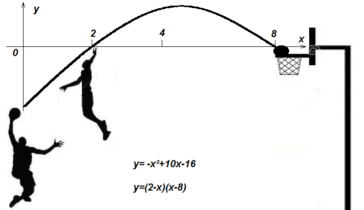

# En construction

Chapitre 6 : factorisation et équation produit

À quoi ça sert : Certains problèmes ne peuvent pas être résolus avec les
connaissances de 3eme. Ce chapitre nous permet de simplifier des
problèmes pour arriver à trouver leur(s) solution(s).

Ce que je dois savoir faire sur le Chapitre 06 - Factorisation-équation produit 

Je sais développer une expression numérique (rappel) 

Je sais factoriser une expression numérique simple

Je sais résoudre une équation produit

I. Développement (Rappel)

[,,et, on a :]{.image}

I.  Factorisation

**Définition** : Factoriser** une somme, c'est la transformer en un
produit.

On utilise la règle de distributivité simple en sens inverse

**Propriété :** Quels que soient les nombres *a*, *b* et **k** :

**k** × a + **k** × b = **k** ×* (*a + b*)

**k** × a -- **k** × b = **k** *× (*a -- b*)

On met **k*** en facteur. On dit que k est un **facteur commun.**

**Exemples :Factoriser**

fin séance 1

corriger B et C

exo 24 p 31 et 38 p 32

fin séance 2

exercice : Développer et simplifier

[]{.image}

[]{.image}

Factoriser

[]{.image}

fin séance 3

I.  Équation produit

(2x + 8) (12 -- 6x) = 0 **est une équation produit**

«  la méthode du chapitre précédent ne fonctionne pas, car si on
développe on obtient une équation du second degré ... »

**Définition**: Une « équation produit » est une équation dans
laquelle il y a un **produit de facteurs** dans l'un des deux membres et
**zéro** dans l'autre

**Propriété **: Si un produit de facteurs est nul, cela revient à dire
qu'au moins un des facteurs est nul.

Si A et B désignent deux nombres relatifs :

A×B = 0\
revient à dire que []{.image} ou

Exemple :Résoudre l'équation suivante : (2x + 8) (12 -- 6x) = 0

C'est une équation produit

Donc, soit (2x + 8) = 0 , soit (12 -- 6x) = 0

[]{.image}

**Remarque** : Cette équation admet **deux** solutions  -4 et 2

Faire la vérification pour montrer que ça marche...

exo 57 et 58 p 33