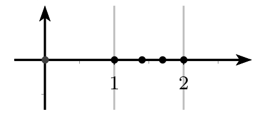
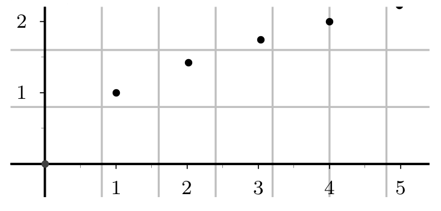

# Rappels sur les suites

## Définition

!!! Définition
	Une suite notée $u$ ou ($u_n$) est une fonction  dans laquelle  la variable $n$ ne prend que des valeurs entières positives.
	A chaque entier naturel $n$ on associe un nombre réel $u(n)$ image de l'entier $n$ par $u$, notée $u_n$, appelée terme d'indice $n$ ou  terme général de la suite $(u_n)$.

!!! warning
	**Attention bien faire la différence entre le terme général $u_n$ et la suite ($u_n$).**

## Modes de génération d'une suite 

!!! tip "Méthode"
	On peut définir une suite de **façon explicite**  en fonction de $n$ : $\mathbf{u_n=f(n)}$

??? question "Exercice"
	Soit $(u_n)$ la suite définie par $u_n=-5+7n$ pour $n \geqslant0$. 
	Ici $u_n=f(n)$.
	
	1. Déterminer $f$.
	2. Calculer $u_0$, $u_1$, $u_2$, $u_6$

	??? done "Solution"
		1. $f(x)=-5+7x$ 
		2. 
		
			* $u_0=-5+7\times0=-5$		
			* $u_1=-5+7\times1=2$
			* $u_2=-5+7\times2=9$
			* $u_6=-5+7\times6=37$
		   

	   
!!! tip "Méthode"
	On peut définir une suite de **façon récurrente**  du type

	\begin{array}{lcl}
	  u_{0} & = & a \\
	  u_{n+1}  & = &  f(u_n)
	\end{array}

	La suite est définie par la donnée de son premier terme et d'une relation de récurrence entre un terme et 
	le terme suivant )

??? question "Exercice"
	Soit $(u_n)_{n \in \mathbb{N}}$ la suite définie par :

	\[
	\left\{
	\begin{array}{lcl}
	  u_{0} & = & 4 \\
	  u_{n+1}  & = &  0.75 u_n+2
	\end{array}
	\right.
	\]
	
	1. Déterminer $f$ telle que $u_{n+1}=f(u_n)$
	2. Calculer $u_1$, $u_2$, $u_3$. Et pour $u_{100}$, qu'en pensez-vous ?

	??? done "Solution"
		1. Ici $u_{n+1} =f(u_n)$ avec $f(x)=-2x+1$
		2. 
		
			* $u_1=0.75u_0+2=0.75\times4+2=5$
			* $u_2=0.75u_1+2=0.75\times(5)+2=5.75$
			* $u_3=0.75u_2+2=0.75\times5.75+2=6,3125$

		L'inconvénient est que des termes "éloignés" du début de la suite sont difficiles d'accès: pour calculer
		$u_{100}$ il faut, a priori, calculer tous les termes précédents, jusqu'à $u_{99}$ !!
	
Il sera parfois nécessaire d'utiliser un programme afin de calculer des termes éloignées.
		   

!!! tip "Méthode"
	On peut encore définir une suite par l’intermédiaire d’une autre suite ou par une somme de termes, etc. . .
	
	Par exemple :
	
	* $(u_n)$ étant définie, on définit la suite ($v_n$) par : $v_n = u_n- 4$
	* On définit la suite ($w_n$) pour tout $n\in \mathbb{N}^*$ par : 
	
	\[
	w_n =  \sum_{i=1}^n \dfrac{1}{i} =1+\dfrac12+\dfrac13+\cdots+\dfrac{1}{n}
	\]

## Représentation graphique d'une suite

### La suite est définie de façon explicite

On peut representer une telle suite sur une droite (avec donc des points de coordonnées $(u_n;0)$) ou dans 
un plan avec des points de coordonnées $(n;u_n)$.

 
Suite $u_n=\sqrt{n}$ sur une droite : [{.VCenter .Vignette}](./Image/Cours_001.png)

Suite $u_n=\sqrt{n}$ dans un plan : [{.VCenter .Vignette}](./Image/Cours_002.png)

### La suite est définie à l'aide d'une relation de récurrence

Le plan est muni d'un repère , on peut représenter graphiquement les premiers termes de la suite sans 
les calculer à l'aide de la courbe $C_f$ représentant la fonction $f$ et la droite $\Delta$ d'équation $y=x$

!!! tip "Méthode : Programme de construction"

	* Placer $u_0$ sur l'axe des abscisses 
	* Placer le point $A_0$ de $C_f$  d'abscisse de $u_0$, son ordonnée est $u_1=f(u_0)$.
	* Placer le point $B_0$ de $\Delta$ de même ordonnée que $A_0$ c'est-à-dire d'ordonnée $u_1$, son abscisse est aussi $u_1$ 
	* Placer $u_1$ l'abscisse de $B_0$ sur l'axe des abscisses .
	* Recommencer à partir de $u_1$ les mêmes étapes et placer $u_2$, etc...

[{.Center .VignetteMed}](./Image/Cours_003.png)

La lecture graphique donne des valeurs approchées des $u_n$, 
et elle permet d'émettre des conjectures concernant le comportement global et asymptotique de la suite. Elle semble :

* croissante, décroissante ou stationnaire (parfois périodique);
* converger vers l'abscisse du point d'intersection de $C_f$ et de $\Delta$, ou diverger.

??? question "Exercice"
	On considère la suite $(u_n)$ définie par 
	
	\[
	\left\{
	\begin{array}{lcl}
	  u_{0} & = & 1.8 \\
	  u_{n+1}  & = &  f(u_n)
	\end{array}
	\right.
	\]
	
	avec $f(x) =\dfrac{2}{3-x}$.
	
	On admet que $f$ est croissante sur $[0,3[$.<!-- ]-->
	
	1. Construire les premiers termes de la suite en utilisant le programme de construction. 
	2. Conjecturer les variations de la suite $u$. Par quelles valeurs semble-t-elle bornée?

