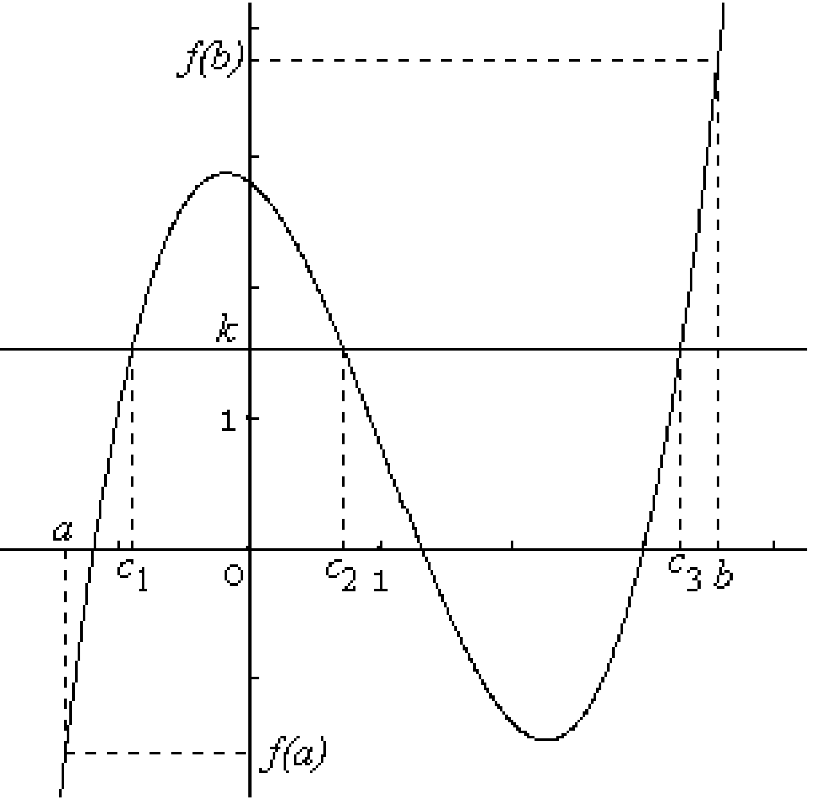

# Théorème des valeurs intermédiaires

## Sur un intervalle fermé borné (un compact)

On conviendra que dans un tableau de variation une flèche vers le haut (respectivement vers le bas) signifie que la fonction ƒ est continue et **strictement**  croissante (respectivement **strictement** décroissante).

!!! info "Théorème des valeurs intermédiaires"
    Soit $f$ une **fonction continue sur un intervalle I** contenant  a et b, avec $a < b$.

    Pour tout réel $k$ compris entre $f(a)$ et $f(b)$, il existe **au moins** un réel $c \in[a,b]$ tel que $f(c)=k$.

    En d'autres termes , $f$ prend au moins une fois toute valeur comprise entre $f(a)$ et $f(b)$.

    [{.Center .Vignette}](../Image/cours_cb3.png)

???- danger "Attention"

    - Même si $f$ est continue sur $[a;b]$, $f([a;b])$ est en général différent de $[f(a);f(b)]$ et de $[f(b);f(a)]$.

    - Ce théorème montre qu'il existe **au moins** un réel $c \in[a,b]$ tel que $f(c)=k$. Il peut donc y en avoir plusieurs !

    - Contrairement au corollaire vu plus loin, il n'est pas nécessaire d'étudier les variations de $f$ sur $[a;b]$ pour utiliser ce théorème.

!!! info "Cas particulier important"
    Soit $f$ une fonction continue sur un intervalle I contenant  a et b ,avec $a < b$.

    Si 0 est compris entre $f(a)$ et $f(b)$ c'est-à-dire si $f(a)$ et $f(b)$ sont de signes contraires (i.e. $f(a)\times f(b) <0$ ) alors il existe au moins un réel $c \in[a,b]$ tel que $f(c)=0$.

???- example "exemple"
    Soit $f(x)=\ex^x-x^3+1$ est définie sur $[-1;4]$. Justifier que $f(x)=1$ possède au moins une solution sur $[-1;4]$.
 

!!! info "Corollaire du théorème des valeurs intermédiaires"
    Si $f$ est une fonction **continue <u>et</u> strictement monotone** sur un intervalle $[a;b]$, pour tout réel $k$ compris entre $f(a)$ et $f(b)$ l'équation $f(x)=k$, d'inconnue $x$, a **une unique solution $\alpha$** dans $[a,b]$.

???- example "exemple"
    Soit $f$ la fonction définie sur $\R$ par
    
    \[
        f(x) = x \ex^{-x} +1
    \]

    1. Etudier les variations de $f$ sur $\R$.
    2. Justifier que l'équation $f(x)=0$ possède une unique solution $\alpha$ sur $[-1;0]$. Donner une valeur de $\alpha$ à $10^{-3}$ près.
    3. En déduire le nombre de solution à $f(x)=0$ sur $\R$.
    4. De façon analogue, justifier que $f(x)=1.2$ possède exactement 2 solutions sur $\R$.

## Résolution d'équations sur un intervalle ouvert, semi -ouvert

On généralise le théorème des valeurs intermédiaires sur un intervalle ouvert  et semi-ouvert. Ce sont donc des limites qui sont calculées &laquo; aux extrémités &raquo; de l'intervalle.

???- example "Exemple"
    Soit $f$ la fonction définie sur $[0,+\infty[$ par $f(x)=\dfrac{xe^{-x}}{x^2+1}$.

    1. Déterminer la limite en $+\infty$ .Interpréter graphiquement le résultat obtenu.
    2. On considère la fonction $g$ définie sur $[0,+\infty[$ par $g(x) =x^3+x^2+x-1$.  
       Etablir que $g(x)=0$ a une unique solution $\alpha$ dans $[0,+\infty[$.  
       En déduire le signe de g(x) 
    3. 
        1. Montrer que pour tout $x$ de $[0,+\infty[$ , $f'(x)$ et $g(x)$ sont de signe contraires.
        2. En déduire le sens de variation de $f$  .
  
    ???- done "Réponse"

        1. $f(x) = xe^{-x} \times \dfrac{1}{x^2+1}$  
           $\Lim{\dlim{x}{+\infty} xe^{-x}=0}{\dlim{x}{+\infty} \dfrac{1}{x^2+1} = 0}$  donc par produit $\dlim{x}{+\infty} f(x) =0$.  
           La droite d'équation $y=0$  est asymptote horizontale à la courbe de la fonction $f$ au voisinage de $+\infty$. 
        2. Pour tout réel $x$  de $[0,+\infty[$ on a $g'(x)=3x^2+ 2x+1$.  
            $g'$ est strictement positive sur $\R$, on en déduit que $g$ est strictement croissante sur $\R$.  
            $g(0)=-1$ et $\dlim{x}{+\infty} g(x) = \dlim{x}{ +\infty} x^3 =+\infty$  
            On applique  le corollaire du théorème des valeurs intermédiaires :  
               - $g$ est continue sur $[0,+\infty[$  
               - $g$ est strictement croissante sur $[0,+\infty[$  
               - $0$ est compris entre -1 et $+\infty [$,  

            donc l'équation $g(x)=0$ admet une solution unique $\alpha$ dans $[0,+\infty[$.  
            <u>Signe de g(x)</u>  
            Sur $]0,\alpha]$ , alors $g(x) \leq 0$ et sur $[\alpha, +\infty[$ , $g(x)  \geq 0$.

        3.  
            1. $f$ est dérivable sur $[0,+\infty[$.  
            On pose $u(x) = x\ex^{-x}$ et $v(x) = x^2+1$.  
            $u'(x) = \ex^{-x} -x\ex^{-x}= \ex^{-x} ( 1-x)$ et $v'(x) = 2x$.  
            $f'(x) = \dfrac{\ex^{-x} ( 1-x)\times (x^2+1) - (  x\ex^{-x} \times 2x)}{ ( x^2+1)^2}= \dfrac{ \ex^{-x} ( 1+x^2-x-x^3-2x^2)}{(1+x^2)^2}=\dfrac{ -g(x) \ex^{-x} }{ ( 1+x^2)^2}$.  
            $f'(x)$ et $g(x)$  sont de signes contraires.  
            2. Tableau de variations  

                [{.Center .VignetteMed}](../Image/Cours_004.png)

