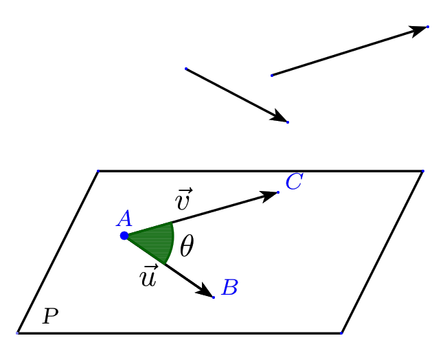

# Produit scalaire de deux vecteurs de l'espace

## Définition

!!! info "Définition"

    $\V{u}$ et $\V{v}$ sont deux vecteurs de l’espace.

    A,B,C sont trois points de l’espace tels que   $\V{u}=\V{AB}$  et  $\V{v}=\V{AC}$
    Il existe toujours au moins un plan P contenant les  points A,B,C.

    Dans l’espace, le produit scalaire des vecteurs $\V{u}$ et $\V{v}$ est le produit scalaire   calculé dans le plan P.

Il en résulte que les expressions du produit scalaire établies dans le plan sont encore valables .

!!! info "Formules connues"
    - $\V{u}.\V{v}=AB\times AC \cos(\theta)$  avec $\theta= \widehat{BAC}$

        [{.Center_lien .Vignette}](../Image/Im06.png)

    - $\V{u}.\V{v}=\V{AB}\cdot\V{AH}$

        où $H$ est le projeté orthogonal de $C$ sur $(AB)$ c'est-à-dire le point d'intersection du plan $\mathcal{P'}$ passant par $C$ et orthogonal à la droite $(AB)$.

        [{.Center_lien .Vignette}](../Image/Im07.png)

    - Avec les normes (par exemple) : 
    
        \[
            \V{u}.\V{v}=\frac{1}{2}\left({||\V{u}+\V{v}||}^2-{||\V{u}||}^2-{||\V{v}||}^2 \right)
        \]
        
!!! info "Règles de calcul : comme dans le plan"
    $\V{u}$, $\V{v}$ et $\V{w}$ sont trois vecteurs de l'espace et  $k$ est un réel.

    - Le produit scalaire de deux vecteurs de l'espace est symétrique c'est-à-dire $\V{u}.\V{v}=\V{v}.\V{u}$.
    - Le produit scalaire de deux vecteurs de l'espace est bilinéaire c'est-à-dire :

        - $(k\V{u}).\V{v}=k\V{u}.\V{v}$
        - $\V{u}.(\V{v}+\V{w})=\V{u}.\V{v}+\V{u}.\V{w}$
        
    - $\V{u}\cdot\V{u}=\|\V{u}\|^2=\V{u}^2$
    - $(\V{u}+\V{v})^2=\V{u}^2+2\V{u}\cdot\V{v}+\V{v}^2$ ou $\|\V{u}+\V{v}\|^2=\|\V{u}\|^2+2\V{u}\cdot\V{v}+\|\V{v}\|^2$
    - z$(\V{u}-\V{v})^2=\V{u}^2-2\V{u}\cdot\V{v}+\V{v}^2$ ou $\|\V{u} - \V{v}\|^2=\|\V{u}\|^2-2\V{u}\cdot\V{v}+\|\V{v}\|^2$ 
    - $(\V{u}+\V{v})\cdot(\V{u}-\V{v}) =\V{u}^2-\V{v}^2=\|\V{u}\|^2-\|\V{v}\|^2$

???- example "Exemple"
    ABCDEFGH est un cube de centre O et d'arête $a$ .
    
    Calculer en fonction de $a$ , les produits scalaires suivants:

    1. $\V{AE}\cdot\V{BG}$
    2. $\V{HB}\cdot\V{BA}$
    3. $\V{AB}\cdot\V{AO}$

    [{.Center_lien .Vignette}](../Image/Im08.png)

    ???- done "Réponse"
        1. $\V{AE}\cdot \V{BG}=\V{AE}\cdot \V{AH}=AE\times AH\times  \cos(\widehat{EAH})=a\times a \sqrt{2}\times \dfrac{1}{\sqrt{2}}=a^2$.
        2.  $(AB)$ est orthogonale à deux droites sécantes ( $(AE)$ et $(AD)$) du plan $(AED)$. Donc $(AB)$ est orthogonale au plan $(AED)$. Elle est donc orthogonale à toutes les droites de $(AED)$, en particulier à $(AH)$.
        
            Le point $A$ est le projeté orthogonal de $H$ sur $(AB)$.
        
            Donc $\V{HB}\cdot\V{BA}=\V{AB} \cdot \V{BA}=-AB \times AB =-a^2$.
        3. Le projeté orthogonal de O sur $(AB)$ est le milieu $I$ du segment $[AB]$.
        
        Donc $\V{AB}\cdot\V{AO}=\V{AB}\cdot\V{AI}=AB\times AI=a\times\dfrac{a}{2}=\dfrac{a^2}{2}$.

!!!- info "Formule de polarisation"

    - $\V{u}.\V{v}=\frac{1}{2}\left({||\V{u}+\V{v}||}^2-{||\V{u}||}^2-{||\V{v}||}^2 \right)$
    - $\V{u}.\V{v}=\frac{1}{2}\left({||\V{u}||}^2+{||\V{v}||}^2 - ||\V{u}-\V{v}||^2\right)$
    - $\V{u}.\V{v}=\frac{1}{4}\left({||\V{u}+\V{v}||}^2 - ||\V{u}-\V{v}||^2\right)$

## Repère orthonormé

!!! info "Base orthonormé"
    Une **base orthonormée ou orthonormale** de l'espace est la donnée de trois vecteurs linéairement indépendants (ou non coplanaires) $\V{i}$, $\V{j}$ et $\V{k}$ tels que $\|\V{i}\| = \|\V{j}\| = \|\V{k}\| = 1$ et $\V{i} \cdot \V{j} =\V{j} \cdot \V{k} = \V{i} \cdot \V{k} =0$.

!!! info "Repère orthonormé"
    Un **repère orthonormée ou orthonormal** est un point $O$ et une base orthonormée $(\V{i},\V{j},\V{k})$. on le note alors : $\Oijk$.

!!! info "Formule du produit scalaire"
    On se place dans un repère orthonormé de l'espace \Oijk. Soient $\V{u}(x,y,z)$ et $\V{v}(x',y',z')$  deux vecteurs de l'espace, on a :

    \[
        \V{u}.\V{v}=xx'+yy'+zz' \quad \quad \text{et} \quad \quad  \|\V{u}\|=\sqrt{x^2+y^2+z^2}
    \]

???- example "Exemple"
    ABCDEFGH est un parallélépipède rectangle tel que $AD=AE=1$cm et $AB=2$cm.
    
    $I$ est le centre du carré $ADHE$ et $J$ est le milieu du segment $[GH]$.
    
    L'espace est rapporté au repère orthonormal $\left(A,\dfrac12\V{AB},\V{AD},\V{AE}\right)$.
    
    1. Donner sans justifier les coordonnées de $I,J,F$.
    2. Calculer $\V{JI}\cdot\V{JF}$.
    3. Déterminer l'arrondi au dixième de degré de l'angle $\widehat{IJF}$.

    [{.Center_lien .Vignette}](../Image/Im09.png)

    ???- done "Réponse"
        1. $I\left(0,\dfrac12,\dfrac12\right)$ , $J(1,1,1)$ et $F(2,0,1)$.
        2. $\V{JI}\left(-1,-\dfrac12,-\dfrac12\right)$ , $\V{JF}(1,-1,0)$ et donc $\V{JI}\cdot \V{JF}=-\dfrac12$.
        3. $\cos(\V{JI},\V{JF})=\dfrac{\V{JI}\cdot \V{JF}}{JI\times JF}$.
        
        Or $JI=\sqrt{(-1)^2+\left(-\dfrac12\right)^2+\left(-\dfrac12\right)^2}=\sqrt{\dfrac32}$ et $JF=\sqrt{2}$ donc $\cos(\V{JI},\V{JF})=\cos(\widehat{IJF})=-\dfrac{1}{2\sqrt{3}}$.

        On obtient :$\widehat{IJF}\approx106,8^{\circ}$.

## Orthogonalité dans l'espace

!!! info "Droites orthogonales"
    Deux droites sont dites orthogonales lorsque leurs parallèles respectives passant par un même point sont perpendiculaires.

!!! info "Droite orthogonale à un plan"
    Une droite est orthogonale à un plan lorsqu'elle est orthogonale à **deux droites sécantes** de ce plan.

!!! info "Vecteurs orthogonaux"
    Dire que deux vecteurs $\V{u}$  et $\V{v}$   sont orthogonaux et on note $\V{u}\perp \V{v}$ signifie :
    
    - soit que $\V{u}=\V{0}$ ou  $\V{v}=\V{0}$ 
    - soit les vecteurs $\V{u}$  et $\V{v}$ ( non nuls) sont les vecteurs directeurs de deux  droites  orthogonales.

!!! info "Caractérisation de l'orthogonalité"
    
    - Deux vecteurs $\V{u}$ et $\V{v}$    sont orthogonaux si et seulement si   $\V{u}\cdot\V{v}=0$  
    - Deux droites $D_1$ et $D_2$ de vecteurs directeurs $\V{u_1}$ et $\V{u_2}$ sont orthogonales si et seulement si  $\V{u_1}\cdot \V{u_2}=0$.
    - _Remarque_ : si un vecteur $\V{u}$ est orthogonal à tout vecteur , alors $\V{u}$ est le vecteur nul.

!!! info "Une équivalence à un sens pratique"
    Une droite est orthogonale à un plan si et seulement si elle est orthogonale à toute droite de ce plan.

    [{.Center_lien .Vignette}](../Image/Im10.png)

!!! tip "En pratique"
    Pour démontrer qu'une droite $\Delta$ est orthogonale à un plan $\mathcal{P}$, il suffit d'établir qu'elle orthogonale à deux droites sécantes de ce plan (d'après la définition) !

    Ainsi, pour démontrer qu'une droite $\Delta$ est orthogonale à un plan $\mathcal{P}$, il suffit d'établir qu'un vecteur directeur de $\Delta$ est orthogonal à une base (ou un couple de vecteurs directeurs) du plan $\mathcal{P}$.

???- example "Exemple"
    ABCDEFGH est un cube de côté 1.

    1. Donner les coordonnées des sommets du cube dans le repère orthonormé $(D;\V{DA} ; \V{DC} ; \V{DH})$
    2. Démontrer que les droites(DF) et (EB) sont orthogonales .
    3. Démontrer que la droite (DF) et le plan (EBG) sont orthogonaux.

    [{.Center_lien .Vignette}](../Image/Im11.png)

    ???- done "Réponse"
        1. D(0,0,0) ; A( 1,0,0) ; C(0,1,0) ; H(0,0,1) ; B(1,1,0) ; E( 1,0,1) ; G( 0,1,1)  ; F( 1,1,1)
        2. On va démontrer que les vecteurs $\V{DF}$ et $\V{EB}$ sont orthogonaux.

            $\V{DF}(1,1,1)$ et $\V{EB}(0,1,-1)$.

            Donc $\V{DF} \cdot\V{EB} = 0$.
            
            Ainsi les droites (DF) et (EB) sont orthogonales.

        3. On va démontrer que les vecteurs $\V{EB}$ et $\V{EG}$ sont orthogonaux au vecteur $\V{DF}$.
        
            $\V{EG} (-1,1,0)$  donc   $\V{DF}\cdot\V{EG}=0$.
            
            Les droites (DF) et (EG) sont orthogonales.
            
            La droite (DF) est orthogonale aux droites sécantes (EB) et (EG) du plan (EBG) donc la droite (DF) et le plan (EBG) sont orthogonaux.
