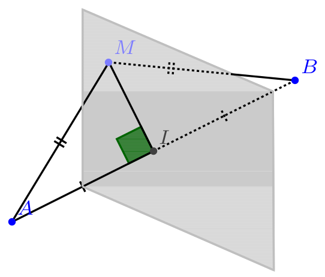

# Plan médiateur

!!! info "Définition d'un plan médiateur"
    Le plan médiateur d'un segment [AB] est le plan orthogonal à (AB) qui passe par le milieu de [AB]. 

    [{.Center .Vignette}](../Image/Im16.png)

!!! info "Caractérisation d'un plan médiateur"
    Le plan médiateur d'un segment [AB] est aussi l'ensemble des points de l'espace équidistants de $A$ et $B$.

???- abstract "Démonstration"
    $A$ et $B$  deux points distincts de l'espace et $I$ le milieu de $[AB]$ .

    1. Montrer que pour tout point M de l'espace , $MA^2=MB^2$ si et seulement si $\V{IM} \cdot\V{AB}=0$.
    2. En déduire que  l'ensemble des points équidistants de $A$ et $B$  est un plan dont on déterminera un point et un vecteur normal.

    ???- done "Réponse"
        1. z

            \begin{eqnarray*}
            MA^2=MB^2 & \iff & \V{MA}^2=\V{MB}^2\\
                    & \iff & \V{MA}^2-\V{MB}^2=0\\
                    & \iff & (\V{MA}-\V{MB})\cdot(\V{MA}+\V{MB})=0\\
                    & \iff & (\V{MA}+\V{BM})\cdot(\V{MA}+\V{MB})=0\\
                    & \iff & (\V{BM}+\V{MA})\cdot(\V{MI}+\V{IA}+\V{MI}+ \V{IB})=0\\
                    & \iff & \V{BA}\cdot(2\V{MI}+\V{0})=0\\
                    & \iff & 2\V{AB}\cdot(\V{IM})=0\\
                    & \iff & \V{IM}\cdot \V{AB}=0\\
            \end{eqnarray*}
        
        2. z

            \begin{eqnarray*}
            M \text{ est équidistant de } A \text{ et } B  & \iff & MA=MB \\
                    & \iff & MA^2=MB^2\\
                    & \iff & \V{IM}\cdot \V{AB}=0
            \end{eqnarray*}

            L'ensemble des points $M$ équidistants de $A$ et $B$  est le plan passant  par le milieu $I$ du segment $[AB]$ et de vecteur normal $\V{AB}$  c'est-à-dire  le plan passant par le milieu $I$ du segment $[AB]$ et qui est orthogonal  à $(AB)$, soit le plan médiateur du segment  $[AB]$ .
