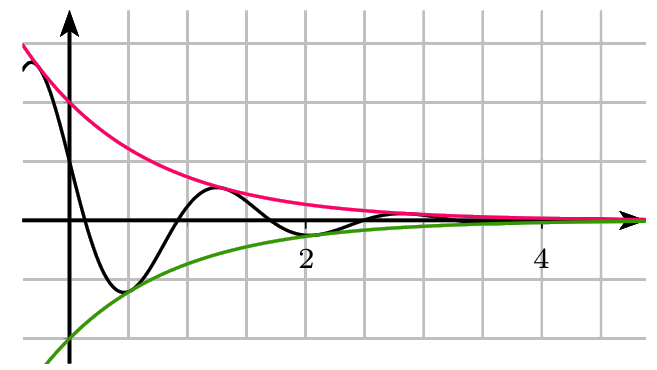

# Limites et comparaison

## Théorème semblable à ceux des suites !

!!! info "Théorème de comparaison"
    Si $f$ et $g$ sont deux fonctions telles que pour $x$ assez grand  , $f(x) \leq g(x)$

    - Si $\dlim{x}{+\infty}f(x)=+\infty$ alors $\dlim{x}{+\infty}g(x) =+\infty$
    - Si $\dlim{x}{+\infty}g(x)=-\infty$ alors $\dlim{x}{+\infty}f(x) =-\infty$

!!! info "Théorème d'encadrement"
    Soit $f ,g, h$ trois fonctions telles que :
    
    $\Lim{\text {Si pour } x \text{ assez grand } f(x) \leq g(x) \leq h(x) }{\text {si} \quad \lim\limits_{x\to +\infty} f(x) =\ell \text{ et si } \quad \lim\limits_{x\to +\infty} h(x) =\ell } \quad \text{ alors } \quad\lim\limits_{x \to +\infty} g(x)=\ell$.

    [{.Center .VignetteMed}](../Image/Cours_010.png)

???- example "Exemple"
    Etudier la limite en $+\infty$ de la fonction $f$ définie sur $]0,+\infty[$ par $f(x)=\dfrac{\sin x}{x}$

    ???- done "Réponse"
        Pour tout réel $x$ $-1 \leq \sin x  \leq 1$ donc pour tout $x>0$ , $\dfrac{-1}{x} \leq  f(x) \leq  \dfrac1x$.
        
        Or $\dlim{x}{+\infty} \dfrac{-1}{x}=0$ et $\dlim{x}{+\infty} \dfrac{1}{x}=0$ donc $\dlim{x}{+\infty}\dfrac{\sin x}{x}=0$.

## Théorème avec l'exponentielle

On rappelle que :

- $\dlim{x}{+\infty} \ex^x=+\infty$
- $\dlim{x}{-\infty} \ex^x=0$

!!! info "Croissance comparée"
    
    - Pour tout $n\in \N$, $\dlim{x}{+\infty}\dfrac{\ex^x}{x^n}=+\infty$
    - Pour tout $n\in \N$, $\dlim{x}{-\infty} x^n \ex^x=0$

!!! info "Limite et taux d'accroissement"
    
    - $\dlim{x}{0} \dfrac{e^x-1}{x}=1$
    - $\dlim{x}{0} \dfrac{\sin(x)}{x}=1$

???- example "Exemple"
    $\dlim{x}{0} \dfrac{e^{3x}-1}{x}$ ?

    ???- done "Réponse"
        On  pose  $X=3x$.

        $\dfrac{e^{3x}-1}{x}= \dfrac{e^{X}-1}{\dfrac{X}{3}}= 3 \dfrac{e^{X}-1}{X}$.

        On utilise le théorème sur la limite d'une fonction composée.
        
        $\Lim{\dlim{x}{0}3x=0}{\dlim{X}{0}\dfrac{e^X-1}{X}=1\quad \text{ (limite du cours)} }$  donc par composition $\dlim{x}{0}\dfrac{e^{3x}-1}{3x}=1$ et par  produit $\dlim{x}{0} f(x)=3$.
