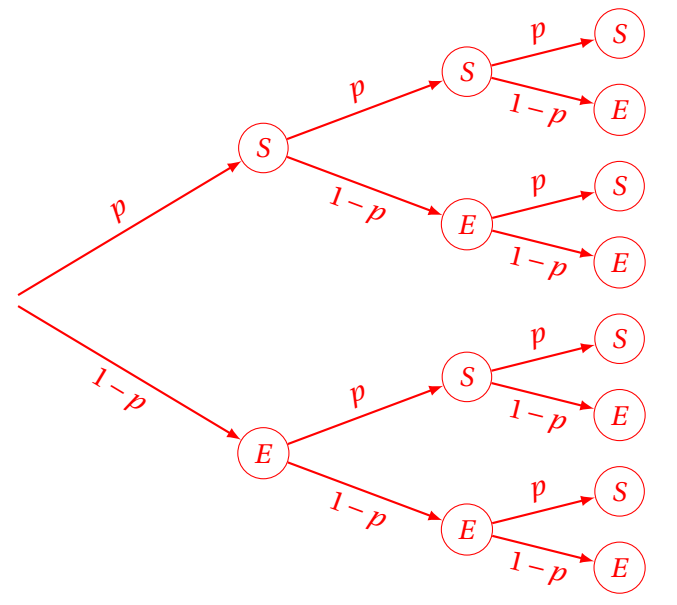
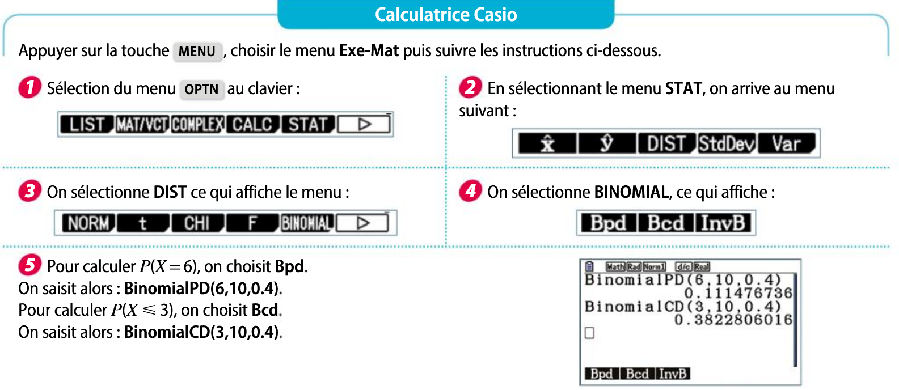
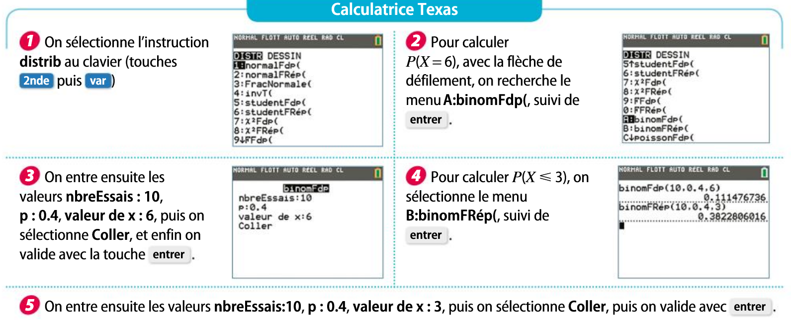

# Loi binomiale

## Schéma de Bernoulli

!!! info "Epreuve de Bernoulli"
    **Une épreuve (ou expérience) de Bernoulli** de paramètre $p$ est une expérience aléatoire présentant deux issues dont l'une, nommée &laquo; succès &raquo;, a pour probabilité $p$ et l'autre, nommée &laquo; échec &raquo; a pour probabilité $1-p$.

    - [La variable aléatoire](AFAIRE) qui prend la valeur $1$ en cas de succès et $0$ en cas d'échec est appelée **variable aléatoire de Bernoulli**.
    - La loi de probabilité de cette variable aléatoire (notée $X$ par exemple) est appelée **loi de Bernoulli de paramètre $\mathbf{p}$.**

    \[
    \begin{array}{|c|c|c|}
    \hline
    x_i & 0 & 1\\
    \hline
    \rule[-0.2cm]{0pt}{0.6cm} \Pb(X=x_i) & 1-p & p\\
    \hline
    \end{array}
    \]

???- example "Exemple"
    Une urne contient dix jetons indiscernables au toucher : 5 bleues, 2 jaunes et 3 rouges. On tire un jeton au hasard.
    
    - L'expérience qui consiste à observer la couleur du jeton tiré n'est pas une épreuve de Bernoulli car il y a 3 issues.
    - L'expérience qui consiste à observer si le jeton est jaune ou  non est une épreuve de Bernoulli. Si on choisit d'appeler &laquo; succès &raquo; : &laquo; obtenir un jeton jaune &raquo;, alors il s'agit d'une épreuve de Bernoulli de paramètre $p=\dfrac{2}{10}=\dfrac{1}{5}$.

!!!- warning "Succès ... discutable"
    Le choix de l'issue correspondant au succès dépend de l'énoncé ! Ce n'est pas toujours quelque chose de positif.

???- example "Exemple"
    Lors de la production de clous de 50 mm, on considère qu'un clou est conforme si sa taille est comprise entre 48 mm et 52 mm. On prélève un clou dans la chaîne de production. On note $X$ la variable aléatoire qui à un clou, associe $1$ si il n'est pas conforme, $0$ sinon.

    Donner la loi de probabilité de $X$, en sachant que la probabilité d'avoir un clou conforme est de $98.3 \%$.

    ???- done "Réponse"
        Il y a deux issues possibles &laquo; ne pas être conforme &raquo; et &laquo; être conforme &raquo;. $X$ est donc une variable aléatoire de Bernoulli. Or, elle associe $1$ si le clou n'est pas conforme. Donc le succès est  &laquo; Avoir un clou qui n'est pas conforme &raquo;. Donc sa loi de probabilité est la loi de Bernoulli de paramètre $p=0.017$.

        \[
        \begin{array}{|c|c|c|}
        \hline
        x_i & 0 & 1\\
        \hline
        \rule[-0.2cm]{0pt}{0.6cm} \Pb(X=x_i) & 0.983 & 0.017 \\
        \hline
        \end{array}
        \]

!!! info "Théorème"
    Si $X$ est une variable aléatoire qui suit une loi de Bernoulli de paramètre $p$, alors :

    - l'[espérance](AFAIRE) : $E(X)=p$
    - la [variance](AFAIRE) : $V(X)=p(1-p)$
    - l'[écart-type](AFAIRE) : $\sigma(X)=\sqrt{p(1-p)}$

???- abstract "Démonstration"
    A partir du tableau de la [loi de probabilité](#loi_prob_bin) :
    - $E(X)=(1-p) \times 0 + p \times 1 = p$
    - La variance :

    \begin{eqnarray*}
    V(X) & = & (1-p) \times (0 - E(X))^2 + p \times (1- E(X))^2\\
    & = & (1-p)p^2 + p(1-p)^2\\
    & = & (1-p)p \times \left( p+(1-p) \right)\\
    & = & (1-p)p
    \end{eqnarray*}

    - $\sigma(X) = \sqrt{V(X)} = \sqrt{p(1-p)}$.

!!! info "Schéma de Bernoulli"
    L'expérience aléatoire consistant en une succession de $n$ épreuves indépendantes de Bernoulli de paramètre $p$ ($p$ est donc la probabilité de succès à une épreuve) s'appelle **un schéma de Bernoulli de paramètre $\mathbf{n}$ et $\mathbf{p}$**.

!!! info "Théorème"
    L'univers des issues d'un schéma de Bernoulli de paramètres $n$ et $p$ est $\{0;1\}^n$.

???- example "Exemple"
    On lance un dé à six faces. On appelle succès &laquo; obtenir un 6 &raquo;. Répéter 3 fois cette épreuve de Bernoulli est un schéma de Bernoulli de paramètre $3$ et $p=\dfrac{1}{6}$.
    
    A l'aide d'un arbre, calculer $\Pb(X=1)$, où $X$ est la variable aléatoire de Bernoulli.

    ???- done "Réponse"
        Voici l'arbre :

        [{.Center_lien .VignetteMed}](../Image/arbre2.png)

        Les triplets formés d'un seul succès sont $(S;E;E),(E;S;E)$ et $(E;E;S)$. Or $\Pb((S;E;E)) =\Pb((E;S;E)) = \Pb((E;E;S)) = pq^2$.
        
        Donc $\Pb(X = 1)=3pq^2$

## Loi binomiale

!!! info "Loi binomiale"
    On considère un schéma de Bernoulli de paramètres $n$ (nombre de répétitions) et $p$ (probabilité d'un succès). La variable aléatoire $X$, qui, à chaque issue de cette expérience, associe le nombre de succès, suit \textbf{la loi binomiale de paramètre $\mathbf{n}$ et $\mathbf{p}$}.

    On note cette loi $\mathcal{B}(n;p)$ et on note $X \sim\mathcal{B}(n;p)$.

!!! tip "Méthode"
    Pour justifier qu'une variable aléatoire suit une loi binomiale :

    - on repère l'épreuve de Bernoulli et on note la probabilité du succès (le succès dépend de la phrase &laquo; $X$ compte le nombre de \ldots &raquo;);
    - on repère le schéma de Bernoulli ( une succession **indépendante** d'épreuve de Bernoulli) et on note le nombre de répétition;
    - on note que la variable aléatoire compte bien le nombre de succès.

!!! info "Théorème"
    $X$ est une variable aléatoire suivant **la loi binomiale** $\mathbf{\mathcal{B}}(n;p)$ et $k$ est un entier compris entre $0$ et $n$. La probabilité d'obtenir exactement $k$ succès parmi les $n$ tentatives est :

    \[
    \Pb(X=k) = \comb{n}{k} \times p^k \times (1-p)^{n-k}
    \]

    où $ \comb{n}{k}$ est le nombre de chemin comportant exactement $k$ succès parmi les $n$ tentatives. Il se lit &laquo; $k$ combinaison parmi $n$ &raquo;. Pour calculer ce nombre,  il est possible d'utiliser la calculatrice ou la formule suivante :

    \[  \comb{n}{k} = \dfrac{n!}{k! \times (n-k)!} \]

    où $k!=1 \times 2 \times \ldots \times k$ se lit &laquo; factorielle $k$ &raquo; (cf [chapitre post épreuve sur le dénombrement](AFAIRE)).

???- example "Exemple"
    La ville de Las Vegas accueille environ $100\,000$ touristes chaque jour. On estime que $5\%$ des touristes ne viennent pas à Las Vegas pour jouer au casino. On interroge au hasard $10$ touristes dans la rue. On note $Y$ la variable aléatoire qui compte le nombre de touristes témoignant ne pas être venus dans cette ville pour jouer.
    
    - Justifier que $Y$ suit une loi binomiale. Préciser ses paramètres.
    - Calculer la probabilité d'avoir exactement 2 touristes qui ne viennent pas pour jouer au casino, parmi les 10 touristes interrogés.

!!! tip "Méthode : utilisation de la calculatrice"
    Pour calculer $\begin{pmatrix} n\\ k \end{pmatrix}$

    ???- tip "Combinaison pour Casio, TI et Numworks"

        [{.Center_lien .VignetteMed}](../Image/Comb.png)
    
    ???- tip "Loi binomiale pour Casio"

        [{.Center_lien .VignetteMed}](../Image/Casio.png)
    
    ???- tip "Loi binomiale pour TI"

        [{.Center_lien .VignetteMed}](../Image/TI.png)

???- example "Exemple"
    On considère la variable aléatoire $X$ qui suit la loi $\mathcal{B}(20;0.36)$. Calculer à l'aide de la calculatrice :
    
    1. $\Pb(X=11)$
    2. $\Pb(X\leq 8)$
    3. $\Pb(X > 15)$
    4. $\Pb(X \geq 17)$
    5. $\Pb(12<X <15)$

???- example "Exemple"

    On lance $n$ fois une pièce équilibrée. Soit $X$ la variable aléatoire qui, à chaque série de $n$ laners, associe le nombre de &laquo; Pile &raquo; obtenus. Déterminer la plus petite valeur de $n$ telle que la probabilité d'obtenir au moins une fois &laquo; Pile &raquo; dépasse $0.999$.

    ???- done "Réponse"

        - L'épreuve de Bernoulli : on lance une pièce et on appelle succès &laquo; avoir Pile &raquo;. Donc $p=\dfrac{1}{2}$
        - Le schéma de Bernoulli : On répète $n$ fois cette expérience de façon indépendante.
        - $X$ est la variable qui, à chaque expérience, associe le nombre de succès.

        Donc $X$ suit une loi binomiale $\mathcal{B}\left( n ; \dfrac{1}{2}\right)$.

        \begin{eqnarray*}
        \Pb(X\geq 1) & = & 1-\Pb(X=0)\\
        & = & 1 - \comb{n}{0}\times \left( \dfrac{1}{2}\right)^0 \times \left( \dfrac{1}{2}\right)^{n-0}\\
        & = & 1-\left( \dfrac{1}{2}\right)^n
        \end{eqnarray*}

        On doit donc résoudre l'inéquation $1-\left( \dfrac{1}{2}\right)^n \geq 0.999$, soit $\left( \dfrac{1}{2}\right)^n \leq 0.001$.

        Avec la méthode par balayage, on trouve qu'à partir de $n=10$, la probabilité d'obtenir au moins un &laquo; Pile &raquo; est supérieure à $0.999$.

        cf [une autre méthode avec le logarithme](AFAIRE).

???- example "Exemple"

    Dans une chaîne de production pharmaceutique, la proportion de gélules non commercialisables en sortie de chaîne est $3\%$.
    Soit $X$ la variable aléatoire qui, à chaque échantillon de $200$ gélules (le prélèvement est assimilé à un tirage avec remise), associe le nombre de gélules non commercialisables.

    1. Quelle est la loi suivie par $X$ ? (Justifier)
    2. A l'aide d'une calculatrice, déterminer le plus petit entier $b$ tel que $\Pb(X \in [0;b]) \geq 0.9$. Interpréter ce résultat.
    3. A l'aide d'une calculatrice, déterminer les entiers $a$ et $b$ tels que $a$ est le plus petit entier tel que $\Pb(X\leq a) > 0.025$ et $b$ est le plus petit entier tel que $\Pb(X\leq b)\geq 0.975$.

    ???- done "Réponse"

        1. Le fait de choisir une gélule est une épreuve de Bernoulli dont le succès &laquo; la gélule est non commercialisable&raquo;  a pour probabilité $p=0.03$.
        
            La constitution de l'échantillon revient à réaliser $200$ fois de façon indépendante (en tant que tirage avec remise) cette épreuve de Bernoulli.
        
            Par ailleurs, $X$ compte le nombre de succès.

            Donc $X$ suit une loi binomiale $\mathcal{B}(200 ; 0.03)$.

        2. On utilise un tableau de valeur pour $\Pb(X\leq k)$, pour $k$ compris entre $0$ et $200$ :

            [{.Center_lien .VignetteMed}](../Image/Ex58.png)

            En parcourant les valeurs de la table, on obtient $b=9$, puisque $\Pb(X\leq 8) \approx 0.85$ et $\Pb(X\leq 9) \approx 0.92$.

            On peut affirmer qu'au moins $90\%$ des échantillons de 200 gélules ne contiennent pas plus de 9 gélules défectueuses

        3. En utilisant le même tableau de la calculatrice, on trouve $a=2$ et $b=11$.
        4. 

            \begin{eqnarray*}
            \Pb(X \in I) & = & \Pb(2 \leq X \leq 11)\\
            & = & \Pb(X \leq 11) - \Pb(X<2)\\
            & = & \Pb(X \leq 11) - \Pb(X\leq 1)
            \end{eqnarray*}
        
            Comme $a=2$ est le plus petit entier tel que $\Pb(X \leq a) > 0.25$, $\Pb(X \leq a-1) \leq 0.25$.

            Comme $\Pb(X \geq 11) \geq 0.975$ et $-\Pb(X \leq 1)\geq -0.25$, on trouve que $\Pb(X \leq 11) - \Pb(X \leq 1) \geq 0.975-0.025$.

            Donc $\Pb(X \in I) \geq 0.95$.

            La probabilité d'avoir entre 2 et 11 gélules non commercialisables est supérieure à $95\%$.

!!! info "Théorème"

    Si $X$ suit une loi binomiale de paramètre $n$ et $p$. Alors :

    - $E(X)=np$
    - $V(X)=np(1-p)$
    - $\sigma(X)=\sqrt{np(1-p)}$

