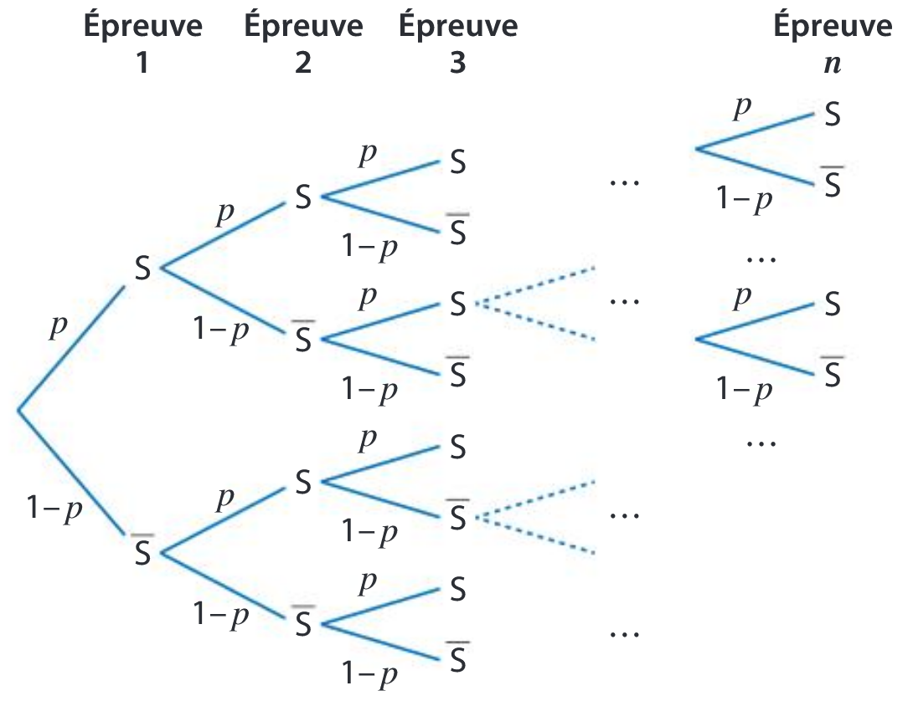

# Loi binomiale : démùonstration au programme

!!! info "Théorème"
    $X$ est une variable aléatoire suivant **la loi binomiale** $\mathbf{\mathcal{B}}(n;p)$ et $k$ est un entier compris entre $0$ et $n$. La probabilité d'obtenir exactement $k$ succès parmi les $n$ tentatives est :

    \[
    \Pb(X=k) = \comb{n}{k} \times p^k \times (1-p)^{n-k}
    \]

    où $ \comb{n}{k}$ est le nombre de chemin comportant exactement $k$ succès parmi les $n$ tentatives. Il se lit &laquo; $k$ combinaison parmi $n$ &raquo;. Pour calculer ce nombre,  il est possible d'utiliser la calculatrice ou la formule suivante :

    \[  \comb{n}{k} = \dfrac{n!}{k! \times (n-k)!} \]

    où $k!=1 \times 2 \times \ldots \times k$ se lit &laquo; factorielle $k$ &raquo;s (cf [chapitre post épreuve sur le dénombrement](AFAIRE)).

???- abstract "Démonstration"
    $X$ suit la loi binomiale de paramètres $n$ et $p$. On représente le schéma de Bernoulli par l'arbre suivant :

    [{.Center_lien .VignetteMed}](../Image/binom.png)

    Soit $k$ un nombre entier compris enter $0$ et $n$. Sur un chemin comportant exactement $k$ succès, il y a donc $k$ fois la probabilité $p$ et $n-k$ fois la probabilité $(1-p)$. Or d'après le théorème sur la succession de $n$ épreuves indépendantes, la probabilité de l'issue correspondant à un tel chemin est $p^k(1-p)^{n-k}$.

    Il reste à déterminer le nombre de chemin comportant exactement $k$ succès.

    Les numéros des épreuves forment l'ensemble $E=\{1;2;\ldots;n\}$. A chaque chemin comportant exactement $k$ succès, on peut associer une partie $E$ à $k$ éléments : les numéros des positions des $S$.
    
    Le nombre de chemins comportant exactement $k$ succès est donc le nombre de parties à $k$ éléments de $E$ qui est $\comb{n}{k}$ (cf [chapitre post épreuve sur le dénombrement](AFAIRE)).

    Par ailleurs, l'événement $(X=k)$ est la réunion de tous les chemins présentant exactement $k$ succès. Donc d'après le principe d'additivité, $\Pb(X=k)$ est égale à la somme des probabilités de chacun de ces chemins.

    Donc $\Pb(X=k)=\comb{n}{k} p^k(1-p)^{n-k}$.